# Huawei LiteOS 开发指南

## 目 录

* [1.知识共享许可协议说明](#1)
* [2.前言](#2)
* [3.概述](#3)
* [4.基础内核](#4)
* [4.1.任务](#4.1)
* [4.2.内存](#4.2)
* [4.3.中断机制](#4.3)
* [4.4.队列](#4.4)
* [4.5.事件](#4.5)
* [4.6.互斥锁](#4.6)
* [4.7.信号量](#4.7)
* [4.8时间管理](#4.8)
* [4.9.软件定时器](#4.9)
* [4.10.双向链表](#4.10)
* [5.Agent Tiny](#5)


<h2 id="1">1.知识共享许可协议说明</h3>

**您可以自由地：**  

**分享** 在任何媒介以任何形式复制、发行本文档

**演绎** 修改、转换或以本文档为基础进行创作

只要你遵守许可协议条款，许可人就无法收回你的这些权利


**惟须遵守下列条件：**  

**署名** 您必须提供适当的证书，提供一个链接到许可证，并指示是否作出更改。您可以以任何合理的方式这样做，但不是以任何方式表明，许可方赞同您或您的使用。

**非商业性使用** 您不得将本文档用于商业目的。

**相同方式共享** 如果您的修改、转换，或以本文档为基础进行创作，仅得依本素材的授权条款来散布您的贡献作品。

**没有附加限制** 您不能增设法律条款或科技措施，来限制别人依授权条款本已许可的作为。


**声明：**  

当您使用本素材中属于公众领域的元素，或当法律有例外或限制条款允许您的使用，则您不需要遵守本授权条款。

未提供保证。本授权条款未必能完全提供您预期用途所需要的所有许可。例如：形象权、隐私权、著作人格权等其他权利，可能限制您如何使用本素材。

    
为了方便用户理解，这是协议的概述. 可以访问网址<https://creativecommons.org/licenses/by-nc-sa/3.0/legalcode>了解完整协议内容。  


<h2 id="2">2.前言</h3>

**目的**

本文档介绍Huawei LiteOS的体系结构，并介绍如何进行开发和调试。

**读者对象**

本文档主要适用于Huawei LiteOS的开发者，主要适用于以下对象：

- 物联网端侧软件开发工程师
- 物联网架构设计师

**符号约定**

在本文中可能出现下列标志，它们所代表的含义如下。  

| 符号 | 说明 |  
| - | :- |  
|| 用于警示紧急的危险情形，若不避免，将会导致人员死亡或严重的人身伤害 |                                                       
|| 用于警示潜在的危险情形，若不避免，可能会导致人员死亡或严重的人身伤害 |
|| 用于警示潜在的危险情形，若不避免，可能会导致中度或轻微的人身伤害 |
|| 用于传递设备或环境安全警示信息，若不避免，可能会导致设备损坏、数据丢失、设备性能降低或其它不可预知的结果，“注意”不涉及人身伤害 |
|**说明** | “说明”不是安全警示信息，不涉及人身、设备及环境伤害信息 |


**修订记录**

修改记录累积了每次文档更新的说明，最新版本的文档包含以前所有文档版本的更新内容。

| 日期 | 修订版本 | 描述 |  
| - | :- | :- |  
| 2018年03月30日 | V2.1.1 | 社区开源版本 |


<h2 id="3">3.概述</h3>

### 背景介绍  

Huawei LiteOS是轻量级的实时操作系统，是华为IOT OS。  

Huawei LiteOS Kernel的基本框架图：  

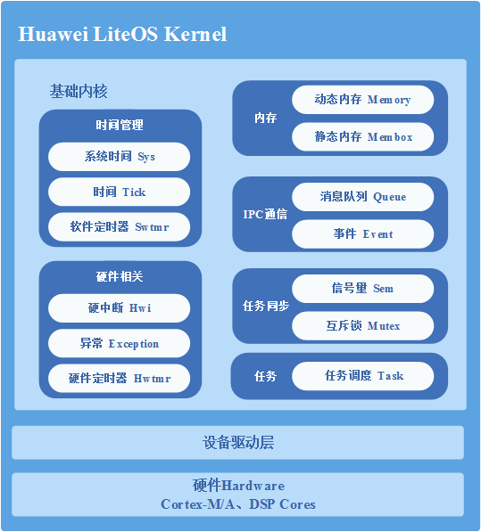

Huawei LiteOS基础内核是最精简的Huawei LiteOS操作系统代码，包括任务管理、内存管理、时间管理、通信机制、中断管理、队列管理、事件管理、定时器等操作系统基础组件，可以单独运行。

**Huawei LiteOS Kernel的优势**

高实时性，高稳定性。

超小内核，基础内核体积可以裁剪至不到10K。

低功耗。

支持动态加载、分散加载。

支持功能静态裁剪。

各模块简介  


**任务**  
提供任务的创建、删除、延迟、挂起、恢复等功能，以及锁定和解锁任务调度。支持任务按优先级高低的抢占调度及同优先级时间片轮转调度。  

**任务同步**  
- 信号量：支持信号量的创建、删除、申请和释放等功能。  
- 互斥锁：支持互斥锁的创建、删除、申请和释放等功能。  

**硬件相关**  
提供中断、定时器等功能。  
- 中断：提供中断的创建、删除、使能、禁止、请求位的清除等功能。  
- 定时器：提供定时器的创建、删除、启动、停止等功能。  

**IPC通信**  
提供事件、消息队列功能。  
- 事件：支持读事件和写事件功能。    
- 消息队列：支持消息队列的创建、删除、发送和接收功能。  

**时间管理**  
- 系统时间：系统时间是由定时/计数器产生的输出脉冲触发中断而产生的。  
- Tick时间：Tick是操作系统调度的基本时间单位，对应的时长由系统主频及每秒Tick数决定，由用户配置。  
- 软件定时器：以Tick为单位的定时器功能，软件定时器的超时处理函数在系统创建的Tick软中断中被调用。  

**内存管理**  
- 提供静态内存和动态内存两种算法，支持内存申请、释放。目前支持的内存管理算法有固定大小的BOX算法、动态申请SLAB、DLINK算法。  
- 提供内存统计、内存越界检测功能。  

### 支持的核

Huawei LiteOS开源Kernel支持的核

| 支持的核  | 芯片                 |
|-----------|----------------------|
| Cortex-M0 | STM32L053R8Tx、ATSAMD21G18A、ATSAMD21J18A、ATSAMR21G18A、EFM32HG322F64、MKL26Z128、MKW41Z512、LPC824M201JHI33、MM32L073PF、nRF51822、NANO130KE3BN |
| Cortex-M3 | STM32F103RB、ATSAM4SD32C、EFM32GG990F1024、GD32F103VCT6、GD32150R8、GD32F190R8、GD32F207VC、MM32F103CBT6、MM32L373PS |
| Cortex-M4 | STM32F411RE、STM32F412ZG、STM32F429ZI、STM32F429IG、STM32L476RG、EFM32PG1B200F256GM48 、GD32F450IK、CC3220SF、LPC54114j256BD64、nRF52840、nRF52832、NUC472HI8AE、ATSAMG55J19、ADuCM4050LF |
| Cortex-M7 | STM32F746ZG、ATSAME70Q21 |

### 使用约束

- Huawei LiteOS提供一套Huawei LiteOS接口，同时支持CMSIS接口，它们功能一致，但混用CMSIS和Huawei LiteOS接口可能会导致不可预知的错误,例如用CMSIS接口申请信号量，但用Huawei LiteOS接口释放信号量。  
- 开发驱动程序只能用Huawei LiteOS的接口，上层APP建议用CMSIS接口。  

<h2 id="4">4.基础内核</h2>

<h3 id="4.1">4.1 任务</h3>

### 概述

#### 基本概念

从系统的角度看，任务是竞争系统资源的最小运行单元。任务可以使用或等待CPU、使用内存空间等系统资源，并独立于其它任务运行。  
Huawei LiteOS的任务模块可以给用户提供多个任务，实现了任务之间的切换和通信，帮助用户管理业务程序流程。这样用户可以将更多的精力投入到业务功能的实现中。  
Huawei LiteOS是一个支持多任务的操作系统。在Huawei LiteOS中，一个任务表示一个线程。  
Huawei LiteOS中的任务是抢占式调度机制，同时支持时间片轮转调度方式。  
高优先级的任务可打断低优先级任务，低优先级任务必须在高优先级任务阻塞或结束后才能得到调度。  
Huawei LiteOS的任务一共有32个优先级(0-31)，最高优先级为0，最低优先级为31。  

#### 任务相关概念

**任务状态**

Huawei LiteOS系统中的每一任务都有多种运行状态。系统初始化完成后，创建的任务就可以在系统中竞争一定的资源，由内核进行调度。  

任务状态通常分为以下四种：  

- 就绪（Ready）：该任务在就绪列表中，只等待CPU。  
- 运行（Running）：该任务正在执行。  
- 阻塞（Blocked）：该任务不在就绪列表中。包含任务被挂起、任务被延时、任务正在等待信号量、读写队列或者等待读写事件等。  
- 退出态（Dead）：该任务运行结束，等待系统回收资源。  

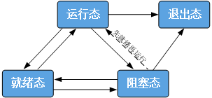

任务状态示意图  


**任务状态迁移说明**  

**就绪态→运行态：**  

任务创建后进入就绪态，发生任务切换时，就绪列表中最高优先级的任务被执行，从而进入运行态，但此刻该任务依旧在就绪列表中。  

**运行态→阻塞态：**  

正在运行的任务发生阻塞（挂起、延时、获取互斥锁、读消息、读信号量等待等）时，该任务会从就绪列表中删除，任务状态由运行态变成阻塞态，然后发生任务切换，运行就绪列表中剩余最高优先级任务。  

**阻塞态→就绪态（阻塞态→运行态）：** 

阻塞的任务被恢复后（任务恢复、延时时间超时、读信号量超时或读到信号量等），此时被恢复的任务会被加入就绪列表，从而由阻塞态变成就绪态；此时如果被恢复任务的优先级高于正在运行任务的优先级，则会发生任务切换，将该任务由就绪态变成运行态。  

**就绪态→阻塞态：**  

任务也有可能在就绪态时被阻塞（挂起），此时任务状态会由就绪态转变为阻塞态，该任务从就绪列表中删除，不会参与任务调度，直到该任务被恢复。  

**运行态→就绪态：**

有更高优先级任务创建或者恢复后，会发生任务调度，此刻就绪列表中最高优先级任务变为运行态，那么原先运行的任务由运行态变为就绪态，依然在就绪列表中。  

**运行态→退出态:**  

运行中的任务运行结束，内核自动将此任务删除，任务状态由运行态变为退出态。  

**阻塞态→退出态:**  

阻塞的任务调用删除接口，任务状态由阻塞态变为退出态。  

**任务ID**  

任务ID，在任务创建时通过参数返回给用户，作为任务的一个非常重要的标识。用户可以通过任务ID对指定任务进行任务挂起、任务恢复、查询任务名等操作。  

**任务优先级**  

优先级表示任务执行的优先顺序。任务的优先级决定了在发生任务切换时即将要执行的任务。在就绪列表中的最高优先级的任务将得到执行。  

**任务入口函数**  

每个新任务得到调度后将执行的函数。该函数由用户实现，在任务创建时，通过任务创建结构体指定。  

**任务控制块TCB**  

每一个任务都含有一个任务控制块(TCB)。TCB包含了任务上下文栈指针（stack pointer）、任务状态、任务优先级、任务ID、任务名、任务栈大小等信息。TCB可以反映出每个任务运行情况。   

**任务栈**  

每一个任务都拥有一个独立的栈空间，我们称为任务栈。栈空间里保存的信息包含局部变量、寄存器、函数参数、函数返回地址等。任务在任务切换时会将切出任务的上下文信息保存在自身的任务栈空间里面，以便任务恢复时还原现场，从而在任务恢复后在切出点继续开始执行。  

**任务上下文**  

任务在运行过程中使用到的一些资源，如寄存器等，我们称为任务上下文。当这个任务挂起时，其他任务继续执行，在任务恢复后，如果没有把任务上下文保存下来，有可能任务切换会修改寄存器中的值，从而导致未知错误。  

因此，Huawei LiteOS在任务挂起的时候会将本任务的任务上下文信息，保存在自己的任务栈里面，以便任务恢复后，从栈空间中恢复挂起时的上下文信息，从而继续执行被挂起时被打断的代码。  

**任务切换**  

任务切换包含获取就绪列表中最高优先级任务、切出任务上下文保存、切入任务上下文恢复等动作。   

#### 运作机制

Huawei LiteOS任务管理模块提供任务创建、任务删除、任务延时、任务挂起和任务恢复、更改任务优先级、锁任务调度和解锁任务调度、根据任务控制块查询任务ID、根据ID查询任务控制块信息功能。  

在任务模块初始化时，系统会先申请任务控制块需要的内存空间，如果系统可用的内存空间小于其所需要的内存空间，任务模块就会初始化失败。如果任务初始化成功，则系统对任务控制块内容进行初始化。  

用户创建任务时，系统会将任务栈进行初始化，预置上下文。此外，系统还会将“任务入口函数”地址放在相应位置。这样在任务第一次启动进入运行态时，将会执行“任务入口函数”。  

### 开发指导

#### 使用场景

任务创建后，内核可以执行锁任务调度，解锁任务调度，挂起，恢复，延时等操作，同时也可以设置任务优先级，获取任务优先级。任务结束的时候，则进行当前任务自删除操作。  

#### 功能

Huawei LiteOS 系统中的任务管理模块为用户提供下面几种功能。

| 功能分类         | 接口名               | 描述                                          |  
|------------------|----------------------|-----------------------------------------------|  
| 任务的创建和删除 | LOS\_TaskCreateOnly  | 创建任务，并使该任务进入suspend状态，并不调度 |  
|                  | LOS\_TaskCreate      | 创建任务，并使该任务进入ready状态，并调度     |  
|                  | LOS\_TaskDelete      | 删除指定的任务                                |  
| 任务状态控制     | LOS\_TaskResume      | 恢复挂起的任务                                |  
|                  | LOS\_TaskSuspend     | 挂起指定的任务                                |  
|                  | LOS\_TaskDelay       | 任务延时等待                                  |  
|                  | LOS\_TaskYield       | 显式放权，调整指定优先级的任务调度顺序        |  
| 任务调度的控制   | LOS\_TaskLock        | 锁任务调度                                    |  
|                  | LOS\_TaskUnlock      | 解锁任务调度                                  |  
| 任务优先级的控制 | LOS\_CurTaskPriSet   | 设置当前任务的优先级                          | 
|                  | LOS\_TaskPriSet      | 设置指定任务的优先级                          |  
|                  | LOS\_TaskPriGet      | 获取指定任务的优先级                          |  
| 任务信息获取     | LOS\_CurTaskIDGet    | 获取当前任务的ID                              |  
|                  | LOS\_TaskInfoGet     | 获取指定任务的信息                            |  
|                  | LOS\_TaskStatusGet   | 获取指定任务的状态                            |  
|                  | LOS\_TaskNameGet     | 获取指定任务的名称                            |  
|                  | LOS\_TaskInfoMonitor | 监控所有任务，获取所有任务的信息              |  
|                  | LOS\_NextTaskIDGet   | 获取即将被调度的任务的ID                      |  

#### 开发流程

以创建任务为例，讲解开发流程。  

1.  在los\_config.h中配置任务模块。

	配置LOSCFG\_BASE\_CORE\_TSK\_LIMIT系统支持最大任务数，这个可以根据需求自己配置。  

	配置LOSCFG\_BASE\_CORE\_TSK\_IDLE\_STACK\_SIZE 空闲（IDLE）任务栈大小，这个默认即可。  

	配置LOSCFG\_BASE\_CORE\_TSK\_DEFAULT\_STACK\_SIZE默认任务栈大小，用户根据自己的需求进行配置，在用户创建任务时，可以进行针对性设置。  
		
	配置LOSCFG\_BASE\_CORE\_TIMESLICE时间片开关为YES。  

	配置LOSCFG\_BASE\_CORE\_TIMESLICE\_TIMEOUT时间片，根据实际情况自己配置。  

	配置LOSCFG\_BASE\_CORE\_TSK\_MONITOR任务监测模块裁剪开关，可选择是否打开。  
	
2.  锁任务LOS\_TaskLock，锁住任务，防止高优先级任务调度。  

3.  创建任务LOS\_TaskCreate。  

4.  解锁任务LOS\_TaskUnlock，让任务按照优先级进行调度。  

5.  延时任务LOS\_TaskDelay，任务延时等待。  

6.  挂起指定的任务LOS\_TaskSuspend，任务挂起等待恢复操作。  

7.  恢复挂起的任务LOS\_TaskResume。  


#### TASK状态

Huawei LiteOS任务的状态由内核自动维护，对用户不可见，不需要用户去操作。  

#### TASK错误码

对任务存在失败可能性的操作，包括创建任务、删除任务、挂起任务、恢复任务、延时任务等等，均需要返回对应的错误码，以便快速定位错误原因。 

| 序号 | 定义                                          | 实际数值   | 描述                                   | 参考解决方案                               |
|------|-----------------------------------------------|------------|----------------------------------------|--------------------------------------------|
| 1    | LOS\_ERRNO\_TSK\_NO\_MEMORY                   | 0x03000200 | 内存空间不足                           | 分配更大的内存分区                         |
| 2    | LOS\_ERRNO\_TSK\_PTR\_NULL                    | 0x02000201 | 任务参数为空                           | 检查任务参数                               |
| 3    | LOS\_ERRNO\_TSK\_STKSZ\_NOT\_ALIGN            | 0x02000202 | 任务栈大小未对齐                       | 对齐任务栈                                 |
| 4    | LOS\_ERRNO\_TSK\_PRIOR\_ERROR                 | 0x02000203 | 不正确的任务优先级                     | 检查任务优先级                             |
| 5    | LOS\_ERRNO\_TSK\_ENTRY\_NULL                  | 0x02000204 | 任务入口函数为空                       | 定义任务入口函数                           |
| 6    | LOS\_ERRNO\_TSK\_NAME\_EMPTY                  | 0x02000205 | 任务名为空                             | 设置任务名                                 |
| 7    | LOS\_ERRNO\_TSK\_STKSZ\_TOO\_SMALL            | 0x02000206 | 任务栈太小                             | 扩大任务栈                                 |
| 8    | LOS\_ERRNO\_TSK\_ID\_INVALID                  | 0x02000207 | 无效的任务ID                           | 检查任务ID                                 |
| 9    | LOS\_ERRNO\_TSK\_ALREADY\_SUSPENDED           | 0x02000208 | 任务已经被挂起                         | 等待这个任务被恢复后，再去尝试挂起这个任务 |
| 10   | LOS\_ERRNO\_TSK\_NOT\_SUSPENDED               | 0x02000209 | 任务未被挂起                           | 挂起这个任务                               |
| 11   | LOS\_ERRNO\_TSK\_NOT\_CREATED                 | 0x0200020a | 任务未被创建                           | 创建这个任务                               |
| 12   | LOS\_ERRNO\_TSK\_OPERATE\_SWTMR               | 0x02000222 | 不允许操作软件定时器任务               | 用户不要试图去操作软件定时器任务的设置     |
| 13   | LOS\_ERRNO\_TSK\_MSG\_NONZERO                 | 0x0200020c | 任务信息非零                           | 暂不使用该错误码                           |
| 14   | LOS\_ERRNO\_TSK\_DELAY\_IN\_INT               | 0x0300020d | 中断期间，进行任务延时                 | 等待退出中断后再进行延时操作               |
| 15   | LOS\_ERRNO\_TSK\_DELAY\_IN\_LOCK              | 0x0200020e | 任务被锁的状态下，进行延时             | 等待解锁任务之后再进行延时操作             |
| 16   | LOS\_ERRNO\_TSK\_YIELD\_INVALID\_TASK         | 0x0200020f | 将被排入行程的任务是无效的             | 检查这个任务                               |
| 17   | LOS\_ERRNO\_TSK\_YIELD\_NOT\_ENOUGH\_TASK     | 0x02000210 | 没有或者仅有一个可用任务能进行行程安排 | 增加任务数                                 |
| 18   | LOS\_ERRNO\_TSK\_TCB\_UNAVAILABLE             | 0x02000211 | 没有空闲的任务控制块可用               | 增加任务控制块数量                         |
| 19   | LOS\_ERRNO\_TSK\_HOOK\_NOT\_MATCH             | 0x02000212 | 任务的钩子函数不匹配                   | 暂不使用该错误码                           |
| 20   | LOS\_ERRNO\_TSK\_HOOK\_IS\_FULL               | 0x02000213 | 任务的钩子函数数量超过界限             | 暂不使用该错误码                           |
| 21   | LOS\_ERRNO\_TSK\_OPERATE\_IDLE                | 0x02000214 | 这是个IDLE任务                         | 检查任务ID，不要试图操作IDLE任务           |
| 22   | LOS\_ERRNO\_TSK\_SUSPEND\_LOCKED              | 0x03000215 | 将被挂起的任务处于被锁状态             | 等待任务解锁后再尝试挂起任务               |
| 23   | LOS\_ERRNO\_TSK\_FREE\_STACK\_FAILED          | 0x02000217 | 任务栈free失败                         | 该错误码暂不使用                           |
| 24   | LOS\_ERRNO\_TSK\_STKAREA\_TOO\_SMALL          | 0x02000218 | 任务栈区域太小                         | 该错误码暂不使用                           |
| 25   | LOS\_ERRNO\_TSK\_ACTIVE\_FAILED               | 0x03000219 | 任务触发失败                           | 创建一个IDLE任务后执行任务转换             |
| 26   | LOS\_ERRNO\_TSK\_CONFIG\_TOO\_MANY            | 0x0200021a | 过多的任务配置项                       | 该错误码暂不使用                           |
| 27   | LOS\_ERRNO\_TSK\_CP\_SAVE\_AREA\_NOT\_ALIGN   | 0x0200021b | 暂无                                   | 该错误码暂不使用                           |
| 28   | LOS\_ERRNO\_TSK\_MSG\_Q\_TOO\_MANY            | 0x0200021d | 暂无                                   | 该错误码暂不使用                           |
| 29   | LOS\_ERRNO\_TSK\_CP\_SAVE\_AREA\_NULL         | 0x0200021e | 暂无                                   | 该错误码暂不使用                           |
| 30   | LOS\_ERRNO\_TSK\_SELF\_DELETE\_ERR            | 0x0200021f | 暂无                                   | 该错误码暂不使用                           |
| 31   | LOS\_ERRNO\_TSK\_STKSZ\_TOO\_LARGE            | 0x02000220 | 任务栈大小设置过大                     | 减小任务栈大小                             |
| 32   | LOS\_ERRNO\_TSK\_SUSPEND\_SWTMR\_NOT\_ALLOWED | 0x02000221 | 不允许挂起软件定时器任务               | 检查任务ID, 不要试图挂起软件定时器任务     |

**错误码定义：** 错误码是一个32位的存储单元，31\~24位表示错误等级，23\~16位表示错误码标志，15\~8位代表错误码所属模块，7\~0位表示错误码序号，如下

```
 #define LOS_ERRNO_OS_NORMAL(MID,ERRNO)
 (LOS_ERRTYPE_NORMAL | LOS_ERRNO_OS_ID | ((UINT32)(MID) << 8) | (ERRNO))
 LOS_ERRTYPE_NORMAL ：Define the error level as critical
 LOS_ERRNO_OS_ID ：OS error code flag.
 MID：OS_MOUDLE_ID
 ERRNO：error ID number
```

例如：

```
LOS_ERRNO_TSK_NO_MEMORY  LOS_ERRNO_OS_FATAL(LOS_MOD_TSK, 0x00)
```

    
	错误码序号 0x16、0x1c、0x0b，未被定义，不可用。

#### 平台差异性

无。  

### 注意事项  

- 创建新任务时，会对之前自删除任务的任务控制块和任务栈进行回收，非自删除任务的控制块和栈在任务删除的时候已经回收。  

- 任务名是指针没有分配空间，在设置任务名时，禁止将局部变量的地址赋值给任务名指针。  

- 若指定的任务栈大小为0，则使用配置项LOSCFG\_BASE\_CORE\_TSK\_DEFAULT\_STACK\_SIZE指定默认的任务栈大小。  

- 任务栈的大小按8字节大小对齐。确定任务栈大小的原则是，够用就行：多了浪费，少了任务栈溢出。  

- 挂起任务的时候若为当前任务且已锁任务，则不能被挂起。  

- 空闲（IDLE）任务及软件定时器任务不能被挂起或者删除。  

- 在中断处理函数中或者在锁任务的情况下，执行LOS\_TaskDelay操作会失败。

- 锁任务调度，并不关中断，因此任务仍可被中断打断。

- 锁任务调度必须和解锁任务调度配合使用。

- 设置任务优先级的时候可能会发生任务调度。

- 除去空闲（IDLE）任务以外，系统可配置的任务资源个数是指：整个系统的任务资源总个数，而非用户能使用的任务资源个数。例如：系统软件定时器多占用一个任务资源数，那么系统可配置的任务资源就会减少一个。

- 为了防止系统出现问题，系统禁止对软件定时器任务优先级进行修改。

- LOS\_CurTaskPriSet和LOS\_TaskPriSet接口不能在中断中使用。

- LOS\_TaskPriGet接口传入的task ID对应的任务未创建或者超过最大任务数，统一返回0xffff。

- 在删除任务时要保证任务申请的资源（如互斥锁、信号量等）已被释放。

### 编程实例

#### 实例描述

下面的示例介绍任务的基本操作方法，包含任务创建、任务延时、任务锁与解锁调度、挂起和恢复、查询当前任务PID、根据PID查询任务信息等操作，阐述任务优先级调度的机制以及各接口的应用。  

1.  创建了2个任务:TaskHi和TaskLo。

2.  TaskHi为高优先级任务。

3.  TaskLo为低优先级任务。

#### 编程示例  


```    
static UINT32 g_uwTskHiID;    
static UINT32 g_uwTskLoID;   

#define TSK_PRIOR_HI 4  
#define TSK_PRIOR_LO 5  

static UINT32 Example_TaskHi(VOID)
{
    UINT32 uwRet = LOS_OK;

    dprintf("Enter TaskHi Handler.\r\n");

    /*延时5个Tick，延时后该任务会挂起，执行剩余任务中高优先级的任务(g_uwTskLoID任务)*/
    uwRet = LOS_TaskDelay(5);
    if (uwRet != LOS_OK)
    {
        dprintf("Delay Task Failed.\r\n");
        return LOS_NOK;
    }

    /*2个tick时间到了后，该任务恢复，继续执行*/
    dprintf("TaskHi LOS_TaskDelay Done.\r\n");

    /*挂起自身任务*/
    uwRet = LOS_TaskSuspend(g_uwTskHiID);
    if (uwRet != LOS_OK)
    {
        dprintf("Suspend TaskHi Failed.\r\n");
        uwRet = LOS_InspectStatusSetByID(LOS_INSPECT_TASK,LOS_INSPECT_STU_ERROR);
        if (LOS_OK != uwRet)
        {
            dprintf("Set Inspect Status Err\n");
        }
        return LOS_NOK;
    }
    
    dprintf("TaskHi LOS_TaskResume Success.\r\n");
        
    uwRet = LOS_InspectStatusSetByID(LOS_INSPECT_TASK,LOS_INSPECT_STU_SUCCESS);
    if (LOS_OK != uwRet)
    {
        dprintf("Set Inspect Status Err\n");
    }
    
    /*删除任务*/
    if(LOS_OK != LOS_TaskDelete(g_uwTskHiID))
    {
        dprintf("TaskHi delete failed .\n");
        return LOS_NOK;
    }
    
    return LOS_OK;
}

/*低优先级任务入口函数*/
static UINT32 Example_TaskLo(VOID)
{
    UINT32 uwRet;

    dprintf("Enter TaskLo Handler.\r\n");

    /*延时10个Tick，延时后该任务会挂起，执行剩余任务中就高优先级的任务(背景任务)*/
    uwRet = LOS_TaskDelay(10);
    if (uwRet != LOS_OK)
    {
        dprintf("Delay TaskLo Failed.\r\n");
        return LOS_NOK;
    }

    dprintf("TaskHi LOS_TaskSuspend Success.\r\n");

    /*恢复被挂起的任务g_uwTskHiID*/
    uwRet = LOS_TaskResume(g_uwTskHiID);
    if (uwRet != LOS_OK)
    {
        dprintf("Resume TaskHi Failed.\r\n");
        uwRet = LOS_InspectStatusSetByID(LOS_INSPECT_TASK,LOS_INSPECT_STU_ERROR);
        if (LOS_OK != uwRet)  
        {
            dprintf("Set Inspect Status Err\n");
        }
        return LOS_NOK;
    }
    
    /*删除任务*/
    if(LOS_OK != LOS_TaskDelete(g_uwTskLoID))
    {
        dprintf("TaskLo delete failed .\n");
        
        return LOS_NOK;
    }
    
    return LOS_OK;  
```  

#### 结果验证

编译运行得到的结果为：  
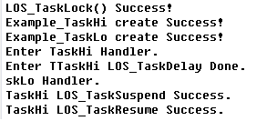

<h3 id="4.2">4.2 内存</h3>

### 概述  

#### 基本概念  

内存管理模块管理系统的内存资源，它是操作系统的核心模块之一。主要包括内存的初始化、分配以及释放。  

在系统运行过程中，内存管理模块通过对内存的申请/释放操作，来管理用户和OS对内存的使用，使内存的利用率和使用效率达到最优，同时最大限度地解决系统的内存碎片问题。  

Huawei LiteOS的内存管理分为静态内存管理和动态内存管理，提供内存初始化、分配、释放等功能。  

- 动态内存：在动态内存池中分配用户指定大小的内存块。   

	- 优点：按需分配。   

	- 缺点：内存池中可能出现碎片。  

- 静态内存：在静态内存池中分配用户初始化时预设（固定）大小的内存块。  

	- 优点：分配和释放效率高，静态内存池中无碎片。  

	- 缺点：只能申请到初始化预设大小的内存块，不能按需申请。  

#### 动态内存运作机制

动态内存管理，即在内存资源充足的情况下，从系统配置的一块比较大的连续内存（内存池），根据用户需求，分配任意大小的内存块。当用户不需要该内存块时，又可以释放回系统供下一次使用。  

与静态内存相比，动态内存管理的好处是按需分配，缺点是内存池中容易出现碎片。   

LiteOS动态内存支持DLINK和BEST LITTLE两种标准算法。  

**1. DLINK** 

DLINK动态内存管理结构如下图所示：  
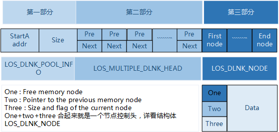  

**第一部分：** 堆内存（也称内存池）的起始地址及堆区域总大小。  

**第二部分：** 本身是一个数组，每个元素是一个双向链表，所有free节点的控制头都会被分类挂在这个数组的双向链表中。  

假设内存允许的最小节点为2<sup>min</sup>字节，则数组的第一个双向链表存储的是所有size为2<sup>min</sup>\<size\< 2<sup>min+1</sup>的free节点，第二个双向链表存储的是所有size为2<sup>min+1</sup>\<size\< 2<sup>min+2</sup>的free节点，依次类推第n个双向链表存储的是所有size为2<sup>min+n-1</sup>\<size\< 2<sup>min+n</sup>的free节点。每次申请内存的时候，会从这个数组检索最合适大小的free节点，进行分配内存。每次释放内存时，会将该片内存作为free节点存储至这个数组，以便下次再利用。

**第三部分：** 占用内存池极大部分的空间，是用于存放各节点的实际区域。以下是```LOS\_MEM\_DYN\_NODE```节点结构体申明以及简单介绍：  
```  
typedef struct tagLOS_MEM_DYN_NODE  
{  
LOS_DL_LIST stFreeNodeInfo;  
struct tagLOS_MEM_DYN_NODE *pstPreNode;  
UINT32 uwSizeAndFlag;  
}LOS_MEM_DYN_NODE;    
```  
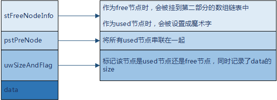

**2.BEST LITTLE**

LiteOS的动态内存分配支持最佳适配算法，即BEST LITTLE，每次分配时选择内存池中最小最适合的内存块进行分配。LiteOS动态内存管理在最佳适配算法的基础上加入了SLAB机制，用于分配固定大小的内存块，进而减小产生内存碎片的可能性。  

LiteOS内存管理中的SLAB机制支持可配置的SLAB CLASS数目及每个CLASS的最大空间，现以SLAB CLASS数目为4，每个CLASS的最大空间为512字节为例说明SLAB机制。在内存池中共有4个SLAB CLASS，每个SLAB CLASS的总共可分配大小为512字节，第一个SLAB CLASS被分为32个16字节的SLAB块，第二个SLAB CLASS被分为16个32字节的SLAB块，第三个SLAB CLASS被分为8个64字节的SLAB块，第四个SLAB CLASS被分为4个128字节的SLAB块。这4个SLAB CLASS是从内存池中按照最佳适配算法分配出来的。  

初始化内存管理时，首先初始化内存池，然后在初始化后的内存池中按照最佳适配算法申请4个SLAB CLASS，再逐个按照SLAB内存管理机制初始化4个SLAB CLASS。  

每次申请内存时，先在满足申请大小的最佳SLAB CLASS中申请，（比如用户申请20字节内存，就在SLAB块大小为32字节的SLAB CLASS中申请），如果申请成功，就将SLAB内存块整块返回给用户，释放时整块回收。如果满足条件的SLAB CLASS中已无可以分配的内存块，则继续向内存池按照最佳适配算法申请。需要注意的是，如果当前的SLAB CLASS中无可用SLAB块了，则直接向内存池申请，而不会继续向有着更大SLAB块空间的SLAB CLASS申请。    

释放内存时，先检查释放的内存块是否属于SLAB CLASS，如果是SLAB CLASS的内存块，则还回对应的SLAB CLASS中，否则还回内存池中。  


#### 静态内存运作机制  

静态内存实质上是一块静态数组，静态内存池内的块大小在初始化时设定，初始化后块大小不可变更。  

静态内存池由一个控制块和若干相同大小的内存块构成。控制块位于内存池头部，用于内存块管理。内存块的申请和释放以块大小为粒度。  

  
静态内存示意图

### 动态内存

#### 开发指导

##### 使用场景

内存管理的主要工作是动态的划分并管理用户分配好的内存区间。  

动态内存管理主要是在用户需要使用大小不等的内存块的场景中使用。  

当用户需要分配内存时，可以通过操作系统的动态内存申请函数索取指定大小内存块，一旦使用完毕，通过动态内存释放函数归还所占用内存，使之可以重复使用。  

##### 功能

Huawei LiteOS系统中的动态内存管理模块为用户提供下面几种功能，具体的API详见接口手册。

| 功能分类                   | 接口名                    | 描述                                                             |
|----------------------------|---------------------------|------------------------------------------------------------------|
| 内存初始化                 | LOS\_MemInit              | 初始化一块指定的动态内存池，大小为size。                         |
| 申请动态内存               | LOS\_MemAlloc             | 从指定动态内存池中申请size长度的内存。                           |
| 释放动态内存               | LOS\_MemFree              | 释放已申请的内存。                                               |
| 重新申请内存               | LOS\_MemRealloc           | 按size大小重新分配内存块，并保留原内存块内容。                   |
| 内存对齐分配               | LOS\_MemAllocAlign        | 从指定动态内存池中申请长度为size且地址按boundary字节对齐的内存。 |
| 分析内存池状态             | LOS\_MemStatisticsGet     | 获取指定内存池的统计信息                                         |
| 查看内存池中最大可用空闲块 | LOS\_MemGetMaxFreeBlkSize | 获取指定内存池的最大可用空闲块                                   |

##### DLINK开发流程

1.  配置：

OS\_SYS\_MEM\_ADDR：系统动态内存池起始地址，一般不需要修改。  

OS\_SYS\_MEM\_SIZE：系统动态内存池大小，以byte为单位，系统默认分配DDR后未使用的空间。  

LOSCFG\_BASE\_MEM\_NODE\_INTEGRITY\_CHECK：内存越界检测开关，默认关闭。打开后，每次申请动态内存时执行动态内存块越界检查；每次释放静态内存时执行静态内存块越界检查。  

2.  初始化LOS\_MemInit。

初始一个内存池后如图，生成一个 EndNode，并且剩余的内存全部被标记为FreeNode节点。  
  
EndNode作为内存池末尾的节点，size为0。  
  

3.  申请任意大小的动态内存LOS\_MemAlloc。  

判断动态内存池中是否存在申请量大小的空间，若存在，则划出一块内存块，以指针形式返回，若不存在，返回NULL。  

调用三次LOS\_MemAlloc函数可以创建三个节点,假设名称分别为UsedA，UsedB，UsedC，大小分别为sizeA，sizeB，sizeC。因为刚初始化内存池的时候只有一个大的FreeNode，所以这些内存块是从这个FreeNode中切割出来的。  
  

当内存池中存在多个FreeNode的时候进行malloc，将会适配最合适大小的FreeNode用来新建内存块，减少内存碎片。若新建的内存块不等于被使用的FreeNode的大小，则在新建内存块后，多余的内存又会被标记为一个新的FreeNode。  

4.  释放动态内存LOS\_MemFree。  

回收内存块，供下一次使用。  

假设调用LOS\_MemFree释放内存块UsedB，则会回收内存块UsedB，并且将其标记为FreeNode。 
    

##### BEST LITTLE开发流程

1. 配置：

OS\_SYS\_MEM\_ADDR：系统动态内存池起始地址，需要用户指定。  

OS\_SYS\_MEM\_SIZE：系统动态内存池大小，以byte为单位，需要用户正确计算。  

LOSCFG\_MEMORY\_BESTFIT：置为YES，选中内存管理算法中的BESTFIT算法。  

LOSCFG\_KERNEL\_MEM\_SLAB：置为YES，打开内存管理中的SLAB机制。  

SLAB\_MEM\_COUNT：该配置位于内核中，一般不需要改动，表示SLAB CLASS的数量，目前内核初始化为4。  

SLAB\_MEM\_ALLOCATOR\_SIZE：该配置位于内核中，一般不需要改动，表示每个SLAB CLASS的最大可分配的块的总空间。  

SLAB\_BASIC\_NEED\_SIZE：该配置位于内核中，一般不需要改动，表示初始化SLAB机制时需要的最小的堆空间。如果改动了SLAB\_MEM\_COUNT和SLAB\_MEM\_ALLOCATOR\_SIZE的配置，就需要同步改动这个配置。  

2. 初始化：  

调用LOS\_MemInit函数初始化用户指定的动态内存池，若用户使能了SLAB机制并且内存池中的可分配内存大于SLAB需要的最小内存，则会进一步初始化SLAB CLASS。   

3. 申请任意大小的动态内存：  

调用LOS\_MemAlloc函数从指定的内存池中申请指定大小的内存块，申请时内存管理先向SLAB CLASS申请，申请失败后继续向堆内存空间申请，最后将申请结果返回给用户。在向堆内存空间申请时，会存在内存块的切分。   
  
4. 释放动态内存：  

调用LOS\_MemFree函数向指定的动态内存池释放指定的内存块，释放时会先判断该内存块是否属于SLAB CLASS，若属于，则将该内存块还回SLAB CLASS。否则，向堆内存空间释放内存块。在向堆内存空间释放时，会存在内存块的合并。  

##### 平台差异性   

无。

#### 注意事项

- 由于系统中动态内存管理需要消耗管理控制块结构的内存，故实际用户可使用空间总量小于在配置文件los\_config.h中配置项OS\_SYS\_MEM\_SIZE的大小。  

- 系统中地址对齐申请内存分配LOS\_MemAllocAlign可能会消耗部分对齐导致的空间，故存在一些内存碎片，当系统释放该对齐内存时，同时回收由于对齐导致的内存碎片。  

- 系统中重新分配内存LOS\_MemRealloc函数如果分配成功，系统会自己判定是否需要释放原来申请的空间，返回重新分配的空间。用户不需要手动释放原来的空间。  

- 系统中多次调用LOS\_MemFree时，第一次会返回成功，但对同一块内存进行多次重复释放会导致非法指针操作，导致结果不可预知。  

#### 编程实例

##### 实例描述

Huawei LiteOS运行期间，用户需要频繁的使用内存资源，而内存资源有限，必须确保将有限的内存资源分配给急需的程序，同时释放不用的内存。  

通过Huawei LiteOS内存管理模块可以保证高效、正确的申请、释放内存。  

本实例执行以下步骤：  

1.  初始化一个动态内存池。  

2.  在动态内存池中申请一个内存块。  

3.  使用这块内存块存放一个数据。  

4.  打印出存放在内存块中的数据。 

5.  释放掉这块内存。  

##### 编程实例  

```  
UINT32 Example_Dyn_Mem(VOID)
{
    UINT32 *p_num = NULL;
    UINT32 uwRet;
    uwRet = LOS_MemInit(m_aucSysMem0, OS_SYS_MEM_SIZE);
    if (LOS_OK == uwRet)
    {
        dprintf("mempool init ok!\n");//内存初始化成功！
    }
    else
    {
        dprintf("mempool init failed!\n");//内存初始化失败！
        return LOS_NOK;
    }
    /*分配内存*/
    p_num = (UINT32*)LOS_MemAlloc(m_aucSysMem0, 4);
    if (NULL == p_num)
    {
        dprintf("mem alloc failed!\n");//内存分配失败！
        return LOS_NOK;
    }
    dprintf("mem alloc ok\n");//内存分配成功！
    /*赋值*/
    *p_num = 828;
    dprintf("*p_num = %d\n", *p_num);
    /*释放内存*/
    uwRet = LOS_MemFree(m_aucSysMem0, p_num);
    if (LOS_OK == uwRet)
    {
        dprintf("mem free ok!\n");//内存释放成功！
        uwRet = LOS_InspectStatusSetByID(LOS_INSPECT_DMEM,LOS_INSPECT_STU_SUCCESS);
  if (LOS_OK != uwRet)  
  {
   dprintf("Set Inspect Status Err\n");
  }
    }
    else
    {
        dprintf("mem free failed!\n");//内存释放失败！
        uwRet = LOS_InspectStatusSetByID(LOS_INSPECT_DMEM,LOS_INSPECT_STU_ERROR);
  if (LOS_OK != uwRet)  
  {
   dprintf("Set Inspect Status Err\n");
  }
        return LOS_NOK;
    }
    return LOS_OK;
}  
```  

##### 结果验证  
结果显示  
  

### 静态内存  

#### 开发指导  

##### 使用场景  

当用户需要使用固定长度的内存时，可以使用静态内存分配的方式获取内存，一旦使用完毕，通过静态内存释放函数归还所占用内存，使之可以重复使用。  

##### 功能  

Huawei LiteOS的静态内存管理主要为用户提供以下功能。  

| 功能分类           | 接口名                   | 描述                                                     |
|--------------------|--------------------------|----------------------------------------------------------|
| 初始化静态内存     | LOS\_MemboxInit          | 初始化一个静态内存池，设定其起始地址、总大小及每个块大小 |
| 清除静态内存内容   | LOS\_MemboxClr           | 清零静态内存块                                           |
| 申请一块静态内存   | LOS\_MemboxAlloc         | 申请一块静态内存块                                       |
| 释放内存           | LOS\_MemboxFree          | 释放一个静态内存块                                       |
| 分析静态内存池状态 | LOS\_MemboxStatisticsGet | 获取静态内存池的统计信息                                 |

##### 开发流程  

本节介绍使用静态内存的典型场景开发流程。  

1.  规划一片内存区域作为静态内存池。    

2.  调用LOS\_MemboxInit接口。    

	系统内部将会初始化静态内存池。将入参指定的内存区域分割为N块（N值取决于静态内存总大小和块大小），将所有内存块挂到空闲链表，在内存起始处放置控制头。  

3.  调用LOS\_MemboxAlloc接口。  

	系统内部将会从空闲链表中获取第一个空闲块，并返回该块的用户空间地址。  

4.  调用LOS\_MemboxFree接口。  

	将该块内存加入空闲块链表。  

5.  调用LOS\_MemboxClr接口。  

	系统内部清零静态内存块，将入参地址对应的内存块清零。  

##### 平台差异性  

无。  

#### 注意事项  

- 静态内存池区域，可以通过定义全局数组或调用动态内存分配接口方式获取。如果使用动态内存分配方式，在不需要静态内存池时，注意要释放该段内存，避免内存泄露。  

#### 编程实例  

##### 实例描述  

Huawei LiteOS运行期间，用户需要频繁的使用内存资源，而内存资源有限，必须确保将有限的内存资源分配给急需的程序，同时释放不用的内存。

通过内存管理模块可以保证正确且高效的申请释放内存。  

本实例执行以下步骤：  

1.  初始化一个静态内存池。  

2.  从静态内存池中申请一块静态内存。  

3.  使用这块内存块存放一个数据。  

4.  打印出存放在内存块中的数据。  

5.  清除内存块中的数据。  

6.  释放掉这块内存。  

##### 编程实例  
```  
UINT32 Example_StaticMem(VOID) 
{
    UINT32 *p_num = NULL;
    UINT32 uwBlkSize = 3, uwBoxSize = 48;
    UINT32 uwRet;
    
    uwRet = LOS_MemboxInit( &pBoxMem[0], uwBoxSize, uwBlkSize);
    if(uwRet != LOS_OK)
    {
        dprintf("Mem box init failed\n");//内存池初始化失败！
        return LOS_NOK;
    }
    else
    {
        dprintf("Mem box init ok!\n");//内存池初始化成功！
    }
    
    /*申请内存块*/
    p_num = (UINT32*)LOS_MemboxAlloc(pBoxMem);
    if (NULL == p_num) 
    {
        dprintf("Mem box alloc failed!\n");//内存分配失败！
        return LOS_NOK;
    }
    dprintf("Mem box alloc ok\n");
    /*赋值*/
    *p_num = 828;
    dprintf("*p_num = %d\n", *p_num);
     /*清除内存内容*/
     LOS_MemboxClr(pBoxMem, p_num);
     dprintf("clear data ok\n *p_num = %d\n", *p_num);//清除内存成功！
    /*释放内存*/
    uwRet = LOS_MemboxFree(pBoxMem, p_num);
    if (LOS_OK == uwRet)
    {
        dprintf("Mem box free ok!\n");//内存释放成功！
        uwRet = LOS_InspectStatusSetByID(LOS_INSPECT_SMEM,LOS_INSPECT_STU_SUCCESS);
        if (LOS_OK != uwRet)  
        {
            dprintf("Set Inspect Status Err\n");
        }
    }
    else
    {
        dprintf("Mem box free failed!\n");//内存释放失败！
        uwRet = LOS_InspectStatusSetByID(LOS_INSPECT_SMEM,LOS_INSPECT_STU_ERROR);
        if (LOS_OK != uwRet)  
        {
            dprintf("Set Inspect Status Err\n");
        }
    }
    
    return LOS_OK;
}  
```  

##### 结果验证  

结果显示  
    

<h3 id="4.3">4.3 中断机制</h3>

### 概述  

中断是指出现需要时，CPU暂停执行当前程序，转而执行新程序的过程。即在程序运行过程中，系统出现了一个必须由CPU立即处理的事务。此时，CPU暂时中止当前程序的执行转而处理这个事务，这个过程就叫做中断。  

众多周知，CPU的处理速度比外设的运行速度快很多，外设可以在没有CPU介入的情况下完成一定的工作，但某些情况下需要CPU为其做一定的工作。  

通过中断机制，在外设不需要CPU介入时，CPU可以执行其它任务，而当外设需要CPU时通过产生中断信号使CPU立即中断当前任务来响应中断请求。这样可以使CPU避免把大量时间耗费在等待、查询外设状态的操作上，因此将大大提高系统实时性以及执行效率。  

Huawei LiteOS的中断支持：  

- 中断初始化  

- 中断创建  

- 开/关中断  

- 恢复中断  

- 中断使能  

- 中断屏蔽  
  
Huawei LiteOS 开源版本对应的中断机制暂不支持中断共享。  

**中断的介绍**  

与中断相关的硬件可以划分为三类：设备、中断控制器、CPU本身。  

设备：发起中断的源，当设备需要请求CPU时，产生一个中断信号，该信号连接至中断控制器。  

中断控制器：中断控制器是CPU众多外设中的一个，它一方面接收其它外设中断引脚的输入，另一方面，它会发出中断信号给CPU。可以通过对中断控制器编程实现对中断源的优先级、触发方式、打开和关闭源等设置操作。常用的中断控制器有VIC（Vector Interrupt Controller）和GIC（General Interrupt Controller），在ARM Cortex-M系列中使用的中断控制器是NVIC（Nested Vector Interrupt Controller）。  

CPU：CPU会响应中断源的请求，中断当前正在执行的任务，转而执行中断处理程序。  

**和中断相关的名词解释**  

中断号：每个中断请求信号都会有特定的标志，使得计算机能够判断是哪个设备提出的中断请求，这个标志就是中断号。  

中断请求：“紧急事件”需向CPU提出申请（发一个电脉冲信号），要求中断，及要求CPU暂停当前执行的任务，转而处理该“紧急事件”，这一申请过程称为中断申请。  

中断优先级：为使系统能够及时响应并处理所有中断，系统根据中断时间的重要性和紧迫程度，将中断源分为若干个级别，称作中断优先级。Huawei LiteOS支持中断控制器的中断优先级及中断嵌套，同时中断管理未对优先级和嵌套进行限制。  

中断处理程序：当外设产生中断请求后，CPU暂停当前的任务，转而响应中断申请，即执行中断处理程序。  

中断触发：中断源发出并送给CPU控制信号，将接口卡上的中断触发器置“1”，表明该中断源产生了中断，要求CPU去响应该中断,CPU暂停当前任务，执行相应的中断处理程序。  

中断触发类型：外部中断申请通过一个物理信号发送到NVIC，可以是电平触发或边沿触发。  

中断向量：中断服务程序的入口地址。  

中断向量表：存储中断向量的存储区，中断向量与中断号对应，中断向量在中断向量表中按照中断号顺序存储。  

### 开发指导  

#### 使用场景   

当有中断请求产生时，CPU暂停当前的任务，转而去响应外设请求。根据需要，用户通过中断申请，注册中断处理程序，可以指定CPU响应中断请求时所执行的具体操作。  

#### 功能  

Huawei LiteOS 系统中的中断模块为用户提供下面几种功能。  

| **接口名**      | **描述**                       |
|-----------------|--------------------------------|
| LOS\_HwiCreate  | 硬中断创建，注册硬中断处理程序 |
| LOS\_IntUnLock  | 开中断                         |
| LOS\_IntRestore | 恢复到关中断之前的状态         |
| LOS\_IntLock    | 关中断                         |
| LOS\_HwiDelete  | 硬中断删除                     |

#### 开发流程

1.  修改配置项

	- 打开硬中断裁剪开关：LOSCFG\_PLATFORM\_HWI定义为YES   

	- 配置硬中断使用最大数：LOSCFG\_PLATFORM\_HWI\_LIMIT  

2.  调用中断初始化Los\_HwiInit接口。  

3.  调用中断创建接口LOS\_HwiCreate创建中断，根据需要使能指定中断。  

4.  调用LOS\_HwiDelete删除中断。  

### 注意事项

- 根据具体硬件，配置支持的最大中断数及中断初始化操作的寄存器地址。  

- 中断处理程序耗时不能过长，影响CPU对中断的及时响应。  

- 关中断后不能执行引起调度的函数。  

- 中断恢复LOS\_IntRestore()的入参必须是与之对应的LOS\_IntLock()保存的关中断之前的PRIMASK的值。  

- Cortex-M系列处理器中1-15中断为内部使用，因此不建议用户去申请和创建。  

### 编程实例  

#### 实例描述  

#### 本实例实现如下功能。  

1.  初始化硬件中断  

2.  中断注册  

3.  触发中断  

4.  查看打印结果  

#### 编程示例

**前提条件：**

在los\_config.h中，将```LOSCFG\_PLATFORM\_HWI```定义为YES。  

在los\_config.h中，设置最大硬中断个数```OS\_HWI\_MAX\_USED\_NUM``` 。  

  
目前的中断测试代码提供了基本框架，中断硬件初始化代码请用户根据开发板硬件情况在Example\_Exti0\_Init()函数中自行实现。

代码实现如下：  
```  
static void Example_Exti0_Init()
{
    /*add your IRQ init code here*/

    return;

}

static VOID User_IRQHandler(void)
{
    dprintf("\n User IRQ test\n");
    //LOS_InspectStatusSetByID(LOS_INSPECT_INTERRUPT,LOS_INSPECT_STU_SUCCESS);
    return;

}

UINT32 Example_Interrupt(VOID)
{
    UINTPTR uvIntSave;
    uvIntSave = LOS_IntLock();
    
    Example_Exti0_Init();
    
    LOS_HwiCreate(6, 0,0,User_IRQHandler,0);//创建中断
    
    LOS_IntRestore(uvIntSave);
    
    return LOS_OK;
}  
```  

#### 结果验证  
   

<h3 id="4.4">4.4 队列</h3>

### 概述  

#### 基本概念

队列又称消息队列，是一种常用于任务间通信的数据结构，实现了接收来自任务或中断的不固定长度的消息，并根据不同的接口选择传递消息是否存放在自己空间。任务能够从队列里面读取消息，当队列中的消息是空时，挂起读取任务；当队列中有新消息时，挂起的读取任务被唤醒并处理新消息。  

用户在处理业务时，消息队列提供了异步处理机制，允许将一个消息放入队列，但并不立即处理它，同时队列还能起到缓冲消息作用。  

Huawei LiteOS中使用队列数据结构实现任务异步通信工作，具有如下特性：  

- 消息以先进先出方式排队，支持异步读写工作方式。  

- 读队列和写队列都支持超时机制。  

- 发送消息类型由通信双方约定，可以允许不同长度（不超过队列节点最大值）消息。  

- 一个任务能够从任意一个消息队列接收和发送消息。  

- 多个任务能够从同一个消息队列接收和发送消息。  

- 当队列使用结束后，如果是动态申请的内存，需要通过释放内存函数回收。  

#### 运作机制

**队列控制块**

```  
/**
  * @ingroup los_queue
  * Queue information block structure
  */
typedef struct tagQueueCB
{
    UINT8       *pucQueue;      /**< 队列指针 */
    UINT16      usQueueState;   /**< 队列状态 */
    UINT16      usQueueLen;     /**< 队列中消息个数 */
    UINT16      usQueueSize;    /**< 消息节点大小 */
    UNIT16      usQueueID;      /**< 队列ID号 */
    UINT16      usQueueHead;    /**< 消息头节点位置（数组下标）*/
    UINT16      usQueueTail;    /**< 消息尾节点位置（数组下标）*/
    UINT16      usReadWritableCnt[2];  /**< 队列中可写或可读消息数，0表示可读，1表示可写*/
    LOS_DL_LIST stReadWriteableList[2];    /**< 读写阻塞队列，0表示读阻塞队列，1表示写阻塞队列*/
    LOS_DL_LIST stMemList;      /**< MailBox模块使用 */
} QUEUE_CB_S;  
```  

每个队列控制块中都含有队列状态，表示该队列的使用情况：  

- OS\_QUEUE\_UNUSED：队列没有使用

- OS\_QUEUE\_INUSED：队列被使用

**队列运作原理**

创建队列时，根据用户传入队列长度和消息节点大小来开辟相应的内存空间以供该队列使用，返回队列ID。  

在队列控制块中维护一个消息头节点位置Head和一个消息尾节点位置Tail来表示当前队列中消息存储情况。Head表示队列中被占用消息的起始位置。Tail表示队列中被空闲消息的起始位置。刚创建时Head和Tail均指向队列起始位置。  

写队列时，根据Tail找到被占用消息节点末尾的空闲节点作为数据写入对象。如果Tail已经指向队列尾则采用回卷方式。根据usWritableCnt判断队列是否可以写入，不能对已满（usWritableCnt为0）队列进行写队列操作。  

读队列时，根据Head找到最先写入队列中的消息节点进行读取。如果Head已经指向队列尾则采用回卷方式。根据usReadableCnt判断队列是否有消息读取，对全部空闲（usReadableCnt为0）队列进行读队列操作会引起任务挂起。  

删除队列时，根据传入的队列ID寻找到对应的队列，把队列状态置为未使用，释放原队列所占的空间，对应的队列控制头置为初始状态。  

队列读写数据操作示意图  
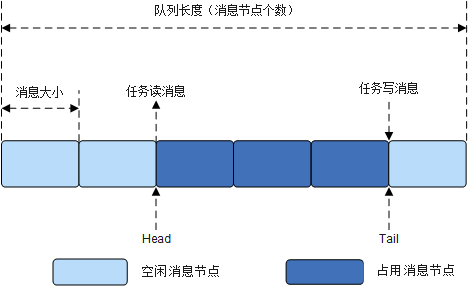  

### 开发指导

#### 功能

Huawei LiteOS中Message消息处理模块提供了以下功能。  

| 功能分类           | 接口名              | 描述                                                     |
|--------------------|---------------------|----------------------------------------------------------|
| 创建消息队列       | LOS\_QueueCreate    | 创建一个消息队列                                         |
| 读队列（不带拷贝） | LOS\_QueueRead      | 读取指定队列中的数据。（buff里存放的是队列节点的地址）   |
| 写队列（不带拷贝） | LOS\_QueueWrite     | 向指定队列写数据。（写入队列节点中的是buff的地址）       |
| 读队列（带拷贝）   | LOS\_QueueReadCopy  | 读取指定队列中的数据。（buff里存放的是队列节点中的数据） |
| 写队列（带拷贝）   | LOS\_QueueWriteCopy | 向指定队列写数据。（写入队列节点中的是buff中的数据）     |
| 写队列（头部）     | LOS\_QueueWriteHead | 向指定队列的头部写数据                                   |
| 删除队列           | LOS\_QueueDelete    | 删除一个指定的队列                                       |
| 获取队列信息       | LOS\_QueueInfoGet   | 获取指定队列信息                                         |
  
#### 开发流程  

使用队列模块的典型流程如下：

1.  创建消息队列LOS\_QueueCreate。

	创建成功后，可以得到消息队列的ID值。

2.  写队列操作函数LOS\_QueueWrite。

3.  读队列操作函数LOS\_QueueRead。

4.  获取队列信息函数LOS\_QueueInfoGet。

5.  删除队列LOS\_QueueDelete。

#### QUEUE错误码

对队列存在失败可能性的操作，包括创建队列、删除队列等等，均需要返回对应的错误码，以便快速定位错误原因。  

| 序号 | 定义                                      | 实际数值   | 描述                                          | 参考解决方案                                                                                              |
|------|-------------------------------------------|------------|-----------------------------------------------|-----------------------------------------------------------------------------------------------------------|
| 1    | LOS\_ERRNO\_QUEUE\_MAXNUM\_ZERO           | 0x02000600 | 队列资源的最大数目配置为0                     | 配置要大于0的队列资源的最大数量。如果不使用队列模块，则将配置项设置为将队列资源的最大数量的剪裁设置为NO。 |
| 2    | LOS\_ERRNO\_QUEUE\_NO\_MEMORY             | 0x02000601 | 队列块内存无法初始化                          | 为队列块分配更大的内存分区，或减少队列资源的最大数量     |
| 3    | LOS\_ERRNO\_QUEUE\_CREATE\_NO\_MEMORY     | 0x02000602 | 队列创建的内存未能被请求                      | 为队列分配更多的内存，或减少要创建的队列中的队列长度和节点的数目。                                        |
| 4    | LOS\_ERRNO\_QUEUE\_SIZE\_TOO\_BIG         | 0x02000603 | 队列创建时消息长度超过上限                    | 更改创建队列中最大消息的大小至不超过上限                                                                  |
| 5    | LOS\_ERRNO\_QUEUE\_CB\_UNAVAILABLE        | 0x02000604 | 已超过创建的队列的数量的上限                  | 增加队列的配置资源数量                                                                                    |
| 6    | LOS\_ERRNO\_QUEUE\_NOT\_FOUND             | 0x02000605 | 无效的队列                                    | 确保队列ID是有效的                                                                                        |
| 7    | LOS\_ERRNO\_QUEUE\_PEND\_IN\_LOCK         | 0x02000606 | 当任务被锁定时，禁止在队列中被阻塞            | 使用队列前解锁任务                                                                                        |
| 8    | LOS\_ERRNO\_QUEUE\_TIMEOUT                | 0x02000607 | 等待处理队列的时间超时                        | 检查设置的超时时间是否合适                                                                                |
| 9    | LOS\_ERRNO\_QUEUE\_IN\_TSKUSE             | 0x02000608 | 阻塞任务的队列不能被删除                      | 使任务能够获得资源而不是在队列中被阻塞                                                                    |
| 10   | LOS\_ERRNO\_QUEUE\_WRITE\_IN\_INTERRUPT   | 0x02000609 | 在中断处理程序中不能写队列                    | 将写队列设为非阻塞模式                                                                                    |
| 11   | LOS\_ERRNO\_QUEUE\_NOT\_CREATE            | 0x0200060a | 队列未创建                                    | 检查队列中传递的句柄是否有效                                                                              |
| 12   | LOS\_ERRNO\_QUEUE\_IN\_TSKWRITE           | 0x0200060b | 队列读写不同步                                | 同步队列的读写                                                                                            |
| 13   | LOS\_ERRNO\_QUEUE\_CREAT\_PTR\_NULL       | 0x0200060c | 队列创建过程中传递的参数为空指针              | 确保传递的参数不为空指针                                                                                  |
| 14   | LOS\_ERRNO\_QUEUE\_PARA\_ISZERO           | 0x0200060d | 队列创建过程中传递的队列长度或消息节点大小为0 | 传入正确的队列长度和消息节点大小                                                                          |
| 15   | LOS\_ERRNO\_QUEUE\_INVALID                | 0x0200060e | 读取队列、写入队列的handle无效                | 检查队列中传递的handle是否有效                                                                            |
| 16   | LOS\_ERRNO\_QUEUE\_READ\_PTR\_NULL        | 0x0200060f | 队列读取过程中传递的指针为空                  | 检查指针中传递的是否为空                                                                                  |
| 17   | LOS\_ERRNO\_QUEUE\_READSIZE\_ISZERO       | 0x02000610 | 队列读取过程中传递的缓冲区大小为0             | 通过一个正确的缓冲区大小                                                                                  |
| 18   | LOS\_ERRNO\_QUEUE\_WRITE\_PTR\_NULL       | 0x02000612 | 队列写入过程中传递的指针为空                  | 检查指针中传递的是否为空                                                                                  |
| 19   | LOS\_ERRNO\_QUEUE\_WRITESIZE\_ISZERO      | 0x02000613 | 队列写入过程中传递的缓冲区大小为0             | 通过一个正确的缓冲区大小                                                                                  |
| 20   | LOS\_ERRNO\_QUEUE\_WRITE\_SIZE\_TOO\_BIG  | 0x02000615 | 队列写入过程中传递的缓冲区大小比队列大小要大  | 减少缓冲区大小，或增大队列节点                                                                            |
| 21   | LOS\_ERRNO\_QUEUE\_ISFULL                 | 0x02000616 | 在队列写入过程中没有可用的空闲节点            | 确保在队列写入之前，可以使用空闲的节点                                                                    |
| 22   | LOS\_ERRNO\_QUEUE\_PTR\_NULL              | 0x02000617 | 正在获取队列信息时传递的指针为空              | 检查指针中传递的是否为空                                                                                  |
| 23   | LOS\_ERRNO\_QUEUE\_READ\_IN\_INTERRUPT    | 0x02000618 | 在中断处理程序中不能读队列                    | 将读队列设为非阻塞模式                                                                                    |
| 24   | LOS\_ERRNO\_QUEUE\_MAIL\_HANDLE\_INVALID  | 0x02000619 | 正在释放队列的内存时传递的队列的handle无效    | 检查队列中传递的handle是否有效                                                                            |
| 25   | LOS\_ERRNO\_QUEUE\_MAIL\_PTR\_INVALID     | 0x0200061a | 传入的消息内存池指针为空                      | 检查指针是否为空                                                                                          |
| 26   | LOS\_ERRNO\_QUEUE\_MAIL\_FREE\_ERROR      | 0x0200061b | membox内存释放失败                            | 传入非空membox内存指针                                                                                    |
| 27   | LOS\_ERRNO\_QUEUE\_ISEMPTY                | 0x0200061d | 队列已空                                      | 确保在读取队列时包含消息                                                                                  |
| 28   | LOS\_ERRNO\_QUEUE\_READ\_SIZE\_TOO\_SMALL | 0x0200061f | 读缓冲区大小小于队列大小                      | 增加缓冲区大小，或减小队列节点大小                                                                        |

#### 平台差异性
无。  

### 注意事项

- 系统可配置的队列资源个数是指：整个系统的队列资源总个数，而非用户能使用的个数。例如：系统软件定时器多占用一个队列资源，那么系统可配置的队列资源就会减少一个。

- 调用LOS\_QueueCreate 函数时所传入的队列名暂时未使用，作为以后的预留参数。

- 队列接口函数中的入参uwTimeOut是指相对时间。

- LOS\_QueueReadCopy和LOS\_QueueWriteCopy是一组接口，LOS\_QueueRead和LOS\_QueueWrite是一组接口，两组接口需要配套使用。

- 鉴于LOS\_QueueWrite和LOS\_QueueRead这组接口实际操作的是数据地址，用户必须保证调用LOS\_QueueRead获取到的指针所指向内存区域在读队列期间没有被异常修改或释放，否则可能会导致不可预知的后果。

### 编程实例

#### 实例描述

创建一个队列，两个任务。任务1调用发送接口发送消息；任务2通过接收接口接收消息。  

1.  通过LOS\_TaskCreate创建任务1和任务2。  

2.  通过LOS\_QueueCreate创建一个消息队列。  
  
3.  在任务1 send\_Entry中发送消息。  
 
4.  在任务2 recv\_Entry中接收消息。  

5.  通过LOS\_QueueDelete删除队列。  

#### 编程示例

```  
#include "los_base.h"
#include "los_task.h"
#include "los_swtmr.h"
#include "los_hwi.h"
#include "los_queue.h"
#include "los_event.h"
#include "los_typedef.h"
#include "los_api_msgqueue.h"
#include "los_inspect_entry.h"

#ifdef __cplusplus
#if __cplusplus
extern "C" {
#endif /* __cpluscplus */
#endif /* __cpluscplus */

static UINT32 g_uwQueue;
static CHAR abuf[] = "test is message x";

/*任务1发送数据*/
static void *send_Entry(UINT32 uwParam1,
                UINT32 uwParam2,
                UINT32 uwParam3,
                UINT32 uwParam4)
{
    UINT32 i = 0,uwRet = 0;
    UINT32 uwlen = sizeof(abuf);

    while (i < API_MSG_NUM)
    {
        abuf[uwlen -2] = '0' + i;
        i++;

        /*将abuf里的数据写入队列*/
        uwRet = LOS_QueueWrite(g_uwQueue, abuf, uwlen, 0);
        if(uwRet != LOS_OK)
        {
            dprintf("send message failure,error:%x\n",uwRet);
        }

        LOS_TaskDelay(5);
    }
    return NULL;
}

/*任务2接收数据*/
static void *recv_Entry(UINT32 uwParam1,
                UINT32 uwParam2,
                UINT32 uwParam3,
                UINT32 uwParam4)
{
    UINT32 uwReadbuf;
    UINT32 uwRet = LOS_OK;
    UINT32 uwMsgCount = 0;

    while (1)
    {

        /*读取队列里的数据存入uwReadbuf里*/
        uwRet = LOS_QueueRead(g_uwQueue, &uwReadbuf, 24, 0);
        if(uwRet != LOS_OK)
        {
            dprintf("recv message failure,error:%x\n",uwRet);
            break;
        }
        else
        {
            dprintf("recv message:%s\n", (char *)uwReadbuf);
            uwMsgCount++;
        }
        
        (void)LOS_TaskDelay(5);
    }
    /*删除队列*/
    while (LOS_OK != LOS_QueueDelete(g_uwQueue))
    {
        (void)LOS_TaskDelay(1);
    }
        
    dprintf("delete the queue success!\n");
        
    if(API_MSG_NUM == uwMsgCount)
    {
        uwRet = LOS_InspectStatusSetByID(LOS_INSPECT_MSG,LOS_INSPECT_STU_SUCCESS);
        if (LOS_OK != uwRet)  
        {
            dprintf("Set Inspect Status Err\n");
        }
    }
    else
    {
        uwRet = LOS_InspectStatusSetByID(LOS_INSPECT_MSG,LOS_INSPECT_STU_ERROR);
        if (LOS_OK != uwRet)  
        {
            dprintf("Set Inspect Status Err\n");
        }
    }
        
    return NULL;
}

UINT32 Example_MsgQueue(void)
{
    UINT32 uwRet = 0;
    UINT32 uwTask1, uwTask2;
    TSK_INIT_PARAM_S stInitParam1;

    /*创建任务1*/
    stInitParam1.pfnTaskEntry = send_Entry;
    stInitParam1.usTaskPrio = 9;
    stInitParam1.uwStackSize = LOSCFG_BASE_CORE_TSK_DEFAULT_STACK_SIZE;
    stInitParam1.pcName = "sendQueue";
    LOS_TaskLock();//锁住任务，防止新创建的任务比本任务高而发生调度
    uwRet = LOS_TaskCreate(&uwTask1, &stInitParam1);
    if(uwRet != LOS_OK)
    {
        dprintf("create task1 failed!,error:%x\n",uwRet);
        return uwRet;
    }

    /*创建任务2*/
    stInitParam1.pfnTaskEntry = recv_Entry;
    uwRet = LOS_TaskCreate(&uwTask2, &stInitParam1);
    if(uwRet != LOS_OK)
    {
        dprintf("create task2 failed!,error:%x\n",uwRet);
        return uwRet;
    }

    /*创建队列*/
    uwRet = LOS_QueueCreate("queue", 5, &g_uwQueue, 0, 24);
    if(uwRet != LOS_OK)
    {
        dprintf("create queue failure!,error:%x\n",uwRet);
    }

    dprintf("create the queue success!\n");
    LOS_TaskUnlock();//解锁任务，只有队列创建后才开始任务调度
    
    return LOS_OK;
}  
```

结果验证  
  


<h3 id="4.5">4.5 事件</h3>

### 概述

#### 基本概念

事件是一种实现任务间通信的机制，可用于实现任务间的同步，但事件通信只能是事件类型的通信，无数据传输。一个任务可以等待多个事件的发生：可以是任意一个事件发生时唤醒任务进行事件处理;也可以是几个事件都发生后才唤醒任务进行事件处理。事件集合用32位无符号整型变量来表示，每一位代表一个事件。  

多任务环境下，任务之间往往需要同步操作，一个等待即是一个同步。事件可以提供一对多、多对多的同步操作。一对多同步模型：一个任务等待多个事件的触发；多对多同步模型：多个任务等待多个事件的触发。  

任务可以通过创建事件控制块来实现对事件的触发和等待操作。Huawei LiteOS的事件仅用于任务间的同步，不提供数据传输功能。  

Huawei LiteOS提供的事件具有如下特点： 

- 事件不与任务相关联，事件相互独立，一个32位的变量，用于标识该任务发生的事件类型，其中每一位表示一种事件类型（0表示该事件类型未发生、1表示该事件类型已经发生），一共31种事件类型（第25位保留）。

- 事件仅用于任务间的同步，不提供数据传输功能。

- 多次向任务发送同一事件类型，等效于只发送一次。

- 允许多个任务对同一事件进行读写操作。

- 支持事件读写超时机制。

**事件控制块**
``` 
/**
 * @ingroup los_event
 * Event control structure
 */
typedef struct tagEvent
{
    UINT32 uwEventID;            /**标识发生的事件类型位*/
    LOS_DL_LIST    stEventList;  /**读取事件任务链表*/
} EVENT_CB_S, *PEVENT_CB_S;  
```   
```uwEventID```：用于标识该任务发生的事件类型，其中每一位表示一种事件类型（0表示该事件类型未发生、1表示该事件类型已经发生），一共31种事件类型，第25位系统保留。  

**事件读取模式**  

在读事件时，可以选择读取模式。读取模式如下：  

- 所有事件（LOS\_WAITMODE\_AND）：读取掩码中所有事件类型，只有读取的所有事件类型都发生了，才能读取成功。

- 任一事件（LOS\_WAITMODE\_OR）： 读取掩码中任一事件类型，读取的事件中任意一种事件类型发生了，就可以读取成功。

- 清除事件（LOS\_WAITMODE\_CLR）：LOS\_WAITMODE\_AND| LOS\_WAITMODE\_CLR或 LOS\_WAITMODE\_OR| LOS\_WAITMODE\_CLR 时表示读取成功后，对应事件类型位会自动清除。

#### 运作机制

读事件时，可以根据入参事件掩码类型uwEventMask读取事件的单个或者多个事件类型。事件读取成功后，如果设置LOS\_WAITMODE\_CLR会清除已读取到的事件类型，反之不会清除已读到的事件类型，需显式清除。可以通过入参选择读取模式，读取事件掩码类型中所有事件还是读取事件掩码类型中任意事件。  

写事件时，对指定事件写入指定的事件类型，可以一次同时写多个事件类型。写事件会触发任务调度。  

清除事件时，根据入参事件和待清除的事件类型，对事件对应位进行清0操作。  

事件唤醒任务示意图  
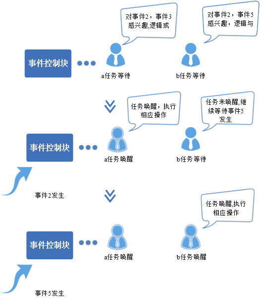   

### 开发指导  

#### 使用场景

事件可应用于多种任务同步场合，能够一定程度替代信号量。  

#### 功能

Huawei LiteOS系统中的事件模块为用户提供下面几个接口。

| 功能分类     | 接口名            | 描述                                                                     |
|--------------|-------------------|--------------------------------------------------------------------------|
| 事件初始化   | LOS\_EventInit    | 初始化一个事件控制块                                                     |
| 读事件       | LOS\_EventRead    | 读取指定事件类型，超时时间为相对时间：单位为Tick                         |
| 写事件       | LOS\_EventWrite   | 写指定的事件类型                                                         |
| 清除事件     | LOS\_EventClear   | 清除指定的事件类型                                                       |
| 校验事件掩码 | LOS\_EventPoll    | 根据用户传入的事件值、事件掩码及校验模式，返回用户传入的事件是否符合预期 |
| 销毁事件     | LOS\_EventDestroy | 销毁指定的事件控制块                                                     |

#### 开发流程

使用事件模块的典型流程如下：  

1.  调用事件初始化LOS\_EventInit接口，初始化事件等待队列。  

2.  写事件LOS\_EventWrite，配置事件掩码类型。  

3.  读事件LOS\_EventRead，可以选择读取模式。  

4.  清除事件LOS\_EventClear，清除指定的事件类型。  

#### Event错误码

对事件存在失败的可能性操作，包括事件初始化，事件销毁，事件读写，时间清除。

| 序号 | 定义                                   | 实际值     | 描述                                                     | 参考解决方案             |
|------|----------------------------------------|------------|----------------------------------------------------------|--------------------------|
| 1    | LOS\_ERRNO\_EVENT\_SETBIT\_INVALID     | 0x02001c00 | 事件ID的第25个bit不能设置为1，因为该位已经作为错误码使用 | 事件ID的第25bit置为0     |
| 2    | LOS\_ERRNO\_EVENT\_READ\_TIMEOUT       | 0x02001c01 | 读超时                                                   | 增加等待时间或者重新读取 |
| 3    | LOS\_ERRNO\_EVENT\_EVENTMASK\_INVALID  | 0x02001c02 | 入参的事件ID是无效的                                     | 传入有效的事件ID参数     |
| 4    | LOS\_ERRNO\_EVENT\_READ\_IN\_INTERRUPT | 0x02001c03 | 在中断中读取事件                                         | 启动新的任务来获取事件   |
| 5    | LOS\_ERRNO\_EVENT\_FLAGS\_INVALID      | 0x02001c04 | 读取事件的mode无效                                       | 传入有效的mode参数       |
| 6    | LOS\_ERRNO\_EVENT\_READ\_IN\_LOCK      | 0x02001c05 | 任务锁住，不能读取事件                                   | 解锁任务，再读取事件     |
| 7    | LOS\_ERRNO\_EVENT\_PTR\_NULL           | 0x02001c06 | 传入的参数为空指针                                       | 传入非空入参             |

**错误码定义：** 错误码是一个32位的存储单元，31\~24位表示错误等级，23\~16位表示错误码标志，15\~8位代表错误码所属模块，7\~0位表示错误码序号，如下  
```    
#define LOS_ERRNO_OS_ERROR(MID, ERRNO)  \
(LOS_ERRTYPE_ERROR | LOS_ERRNO_OS_ID | ((UINT32)(MID) << 8) | (ERRNO))
LOS_ERRTYPE_ERROR：Define critical OS errors
LOS_ERRNO_OS_ID：OS error code flag
MID：OS_MOUDLE_ID
LOS_MOD_EVENT：Event module ID
ERRNO：error ID number  
```  

例如：  
```  
#define LOS_ERRNO_EVENT_READ_IN_LOCK  LOS_ERRNO_OS_ERROR(LOS_MOD_EVENT, 0x05)  
```  

#### 平台差异性  
无。  

### 注意事项

- 在系统初始化之前不能调用读写事件接口。如果调用，则系统运行会不正常。

- 在中断中，可以对事件对象进行写操作，但不能读操作。

- 在锁任务调度状态下，禁止任务阻塞与读事件。

- LOS\_EventClear 入参值是：要清除的指定事件类型的反码（~uwEvents）。

- 事件掩码的第25位不能使用，原因是为了区别LOS\_EventRead接口返回的是事件还是错误码。

### 编程实例

#### 实例描述

示例中，任务Example\_TaskEntry创建一个任务Example\_Event，Example\_Event读事件阻塞，Example\_TaskEntry向该任务写事件。 

1.  在任务Example\_TaskEntry创建任务Example\_Event，其中任务Example\_Event优先级高于Example\_TaskEntry。  

2.  在任务Example\_Event中读事件0x00000001，阻塞，发生任务切换，执行任务Example\_TaskEntry。  

3.  在任务Example\_TaskEntry向任务Example\_Event写事件0x00000001，发生任务切换，执行任务Example\_Event。  

4.  Example\_Event得以执行，直到任务结束。  

5.  Example\_TaskEntry得以执行，直到任务结束。  

#### 编程示例

可以通过打印的先后顺序理解事件操作时伴随的任务切换。  

代码实现如下：  
```  
/*任务PID*/
static UINT32 g_TestTaskID;
//static LITE_OS_SEC_BSS  UINT32  g_uweventTaskID;
/*事件控制结构体*/
static EVENT_CB_S  example_event;

/*等待的事件类型*/
#define event_wait 0x00000001

/*用例任务入口函数*/
VOID Example_Event(VOID)
{
    UINT32 uwEvent;
    UINT32 uwRet = LOS_OK;

    /*超时 等待方式读事件,超时时间为100 Tick
    若100 Tick 后未读取到指定事件，读事件超时，任务直接唤醒*/
    dprintf("Example_Event wait event 0x%x \n",event_wait);

    uwEvent = LOS_EventRead(&example_event, event_wait, LOS_WAITMODE_AND, 100);
    if(uwEvent == event_wait)
    {
        dprintf("Example_Event,read event :0x%x\n",uwEvent);
        uwRet = LOS_InspectStatusSetByID(LOS_INSPECT_EVENT,LOS_INSPECT_STU_SUCCESS);
        if (LOS_OK != uwRet)  
        {
            dprintf("Set Inspect Status Err\n");
        }
    }
    else
    {
        dprintf("Example_Event,read event timeout\n");
        uwRet = LOS_InspectStatusSetByID(LOS_INSPECT_EVENT,LOS_INSPECT_STU_ERROR);
        if (LOS_OK != uwRet)  
        {
            dprintf("Set Inspect Status Err\n");
        }
    }
    return;
}

UINT32 Example_SndRcvEvent(VOID)
{
    UINT32 uwRet;
    TSK_INIT_PARAM_S stTask1;

    /*事件初始化*/
    uwRet = LOS_EventInit(&example_event);
    if(uwRet != LOS_OK)
    {
        dprintf("init event failed .\n");
        return LOS_NOK;
    }

    /*创建任务*/
    memset(&stTask1, 0, sizeof(TSK_INIT_PARAM_S));
    stTask1.pfnTaskEntry = (TSK_ENTRY_FUNC)Example_Event;
    stTask1.pcName       = "EventTsk1";
    stTask1.uwStackSize  = LOSCFG_BASE_CORE_TSK_DEFAULT_STACK_SIZE;
    stTask1.usTaskPrio   = 5;
    uwRet = LOS_TaskCreate(&g_TestTaskID, &stTask1);
    if(uwRet != LOS_OK)
    {
        dprintf("task create failed .\n");
        return LOS_NOK;
    }

    /*写用例任务等待的事件类型*/
    dprintf("Example_TaskEntry_Event write event .\n");

    uwRet = LOS_EventWrite(&example_event, event_wait);
    if(uwRet != LOS_OK)
    {
        dprintf("event write failed .\n");
        return LOS_NOK;
    }

    /*清标志位*/
    dprintf("EventMask:%d\n",example_event.uwEventID);
    LOS_EventClear(&example_event, ~example_event.uwEventID);
    dprintf("EventMask:%d\n",example_event.uwEventID);

    return LOS_OK;
}  
```  


#### 结果验证

编译运行得到的结果为：  
  

<h3 id="4.6">4.6 互斥锁</h3>

### 概述

#### 基本概念

互斥锁又称互斥型信号量，是一种特殊的二值性信号量，用于实现对共享资源的独占式处理。    

任意时刻互斥锁的状态只有两种，开锁或闭锁。当有任务持有时，互斥锁处于闭锁状态，这个任务获得该互斥锁的所有权。当该任务释放它时，该互斥锁被开锁，任务失去该互斥锁的所有权。当一个任务持有互斥锁时，其他任务将不能再对该互斥锁进行开锁或持有。  

多任务环境下往往存在多个任务竞争同一共享资源的应用场景，互斥锁可被用于对共享资源的保护从而实现独占式访问。另外，互斥锁可以解决信号量存在的优先级翻转问题。  

Huawei LiteOS提供的互斥锁具有如下特点：

- 通过优先级继承算法，解决优先级翻转问题。  

#### 运作机制  

**互斥锁运作原理**  

多任务环境下会存在多个任务访问同一公共资源的场景，而有些公共资源是非共享的，需要任务进行独占式处理。互斥锁怎样来避免这种冲突呢？   

用互斥锁处理非共享资源的同步访问时，如果有任务访问该资源，则互斥锁为加锁状态。此时其他任务如果想访问这个公共资源则会被阻塞，直到互斥锁被持有该锁的任务释放后，其他任务才能重新访问该公共资源，此时互斥锁再次上锁，如此确保同一时刻只有一个任务正在访问这个公共资源，保证了公共资源操作的完整性。  

互斥锁运作示意图  
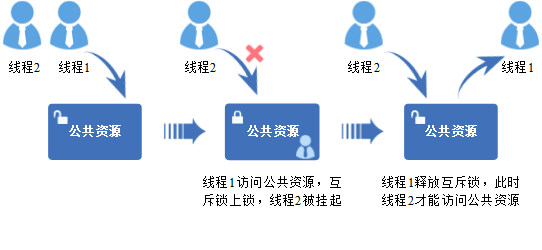  

### 开发指导

#### 使用场景  

互斥锁可以提供任务之间的互斥机制，用来防止两个任务在同一时刻访问相同的共享资源。  

#### 功能  

Huawei LiteOS 系统中的互斥锁模块为用户提供下面几种功能。  

| 功能分类           | 接口名         | 描述             |
|--------------------|----------------|------------------|
| 互斥锁的创建和删除 | LOS\_MuxCreate | 创建互斥锁       |
|                    | LOS\_MuxDelete | 删除指定的互斥锁 |
| 互斥锁的申请和释放 | LOS\_MuxPend   | 申请指定的互斥锁 |
|                    | LOS\_MuxPost   | 释放指定的互斥锁 |

#### 开发流程

互斥锁典型场景的开发流程：  

1.  创建互斥锁LOS\_MuxCreate。  

2.  申请互斥锁LOS\_MuxPend。  

	申请模式有三种：无阻塞模式、永久阻塞模式、定时阻塞模式。

	- 无阻塞模式：任务需要申请互斥锁，若该互斥锁当前没有任务持有，或者持有该互斥锁的任务和申请该互斥锁的任务为同一个任务，则申请成功。  

	- 永久阻塞模式：任务需要申请互斥锁，若该互斥锁当前没有被占用，则申请成功。否则，该任务进入阻塞态，系统切换到就绪任务中优先级最高者继续执行。任务进入阻塞态后，直到有其他任务释放该互斥锁，阻塞任务才会重新得以执行。  

	- 定时阻塞模式：任务需要申请互斥锁，若该互斥锁当前没有被占用，则申请成功。否则该任务进入阻塞态，系统切换到就绪任务中优先级最高者继续执行。任务进入阻塞态后，指定时间超时前有其他任务释放该互斥锁，或者用户指定时间超时后，阻塞任务才会重新得以执行。  

3.  释放互斥锁LOS\_MuxPost。  

	- 如果有任务阻塞于指定互斥锁，则唤醒最早被阻塞的任务，该任务进入就绪态，并进行任务调度；

	- 如果没有任务阻塞于指定互斥锁，则互斥锁释放成功。

4.  删除互斥锁LOS\_MuxDelete。

#### 互斥锁错误码

对互斥锁存在失败的可能性操作，包括互斥锁创建，互斥锁删除，互斥锁申请，互斥锁释放。  

| 序号 | 定义                             | 实际数值   | 描述                                       | 参考解决方案                         |
|------|----------------------------------|------------|--------------------------------------------|--------------------------------------|
| 1    | LOS\_ERRNO\_MUX\_NO\_MEMORY      | 0x02001d00 | 内存请求失败                               | 减少互斥锁限制数量的上限             |
| 2    | LOS\_ERRNO\_MUX\_INVALID         | 0x02001d01 | 互斥锁不可用                               | 传入有效的互斥锁的ID                 |
| 3    | LOS\_ERRNO\_MUX\_PTR\_NULL       | 0x02001d02 | 入参为空                                   | 确保入参可用                         |
| 4    | LOS\_ERRNO\_MUX\_ALL\_BUSY       | 0x02001d03 | 没有互斥锁可用                             | 增加互斥锁限制数量的上限             |
| 5    | LOS\_ERRNO\_MUX\_UNAVAILABLE     | 0x02001d04 | 锁失败，因为锁被其他线程使用               | 等待其他线程解锁或者设置等待时间     |
| 6    | LOS\_ERRNO\_MUX\_PEND\_INTERR    | 0x02001d05 | 在中断中使用互斥锁                         | 在中断中禁止调用此接口               |
| 7    | LOS\_ERRNO\_MUX\_PEND\_IN\_LOCK  | 0x02001d06 | 任务调度没有使能，线程等待另一个线程释放锁 | 设置PEND为非阻塞模式或者使能任务调度 |
| 8    | LOS\_ERRNO\_MUX\_TIMEOUT         | 0x02001d07 | 互斥锁PEND超时                             | 增加等待时间或者设置一直等待模式     |
| 9    | LOS\_ERRNO\_MUX\_OVERFLOW        | 0x02001d08 | 暂未使用，待扩展                           | 无                                   |
| 10   | LOS\_ERRNO\_MUX\_PENDED          | 0x02001d09 | 删除正在使用的锁                           | 等待解锁再删除锁                     |
| 11   | LOS\_ERRNO\_MUX\_GET\_COUNT\_ERR | 0x02001d0a | 暂未使用，待扩展                           | 无                                   |
| 12   | LOS\_ERRNO\_MUX\_REG\_ERROR      | 0x02001d0b | 暂未使用，待扩展                           | 无                                   |

**错误码定义：** 错误码是一个32位的存储单元，31\~24位表示错误等级，23\~16位表示错误码标志，15\~8位代表错误码所属模块，7\~0位表示错误码序号，如下  
```  
#define LOS_ERRNO_OS_ERROR(MID, ERRNO)  \
(LOS_ERRTYPE_ERROR | LOS_ERRNO_OS_ID | ((UINT32)(MID) << 8) | (ERRNO))
LOS_ERRTYPE_ERROR：Define critical OS errors
LOS_ERRNO_OS_ID：OS error code flag
LOS_MOD_MUX：Mutex module ID
MID：OS_MOUDLE_ID
ERRNO：error ID number  
```  

例如：  
```  
LOS_ERRNO_MUX_TIMEOUT       LOS_ERRNO_OS_ERROR(LOS_MOD_MUX, 0x07)   
```  

#### 平台差异性
无。  

### 注意事项

- 两个任务不能对同一把互斥锁加锁。如果某任务对已被持有的互斥锁加锁，则该任务会被挂起，直到持有该锁的任务对互斥锁解锁，才能执行对这把互斥锁的加锁操作。

- 互斥锁不能在中断服务程序中使用。

- Huawei LiteOS作为实时操作系统需要保证任务调度的实时性，尽量避免任务的长时间阻塞，因此在获得互斥锁之后，应该尽快释放互斥锁。

- 持有互斥锁的过程中，不得再调用LOS\_TaskPriSet等接口更改持有互斥锁任务的优先级。

### 编程实例

#### 实例描述

本实例实现如下流程。 

1.  任务Example\_TaskEntry创建一个互斥锁，锁任务调度，创建两个任务Example\_MutexTask1、Example\_MutexTask2,Example\_MutexTask2优先级高于Example\_MutexTask1，解锁任务调度。

2.  Example\_MutexTask2被调度，永久申请互斥锁，然后任务休眠100Tick，Example\_MutexTask2挂起，Example\_MutexTask1被唤醒。

3.  Example\_MutexTask1申请互斥锁，等待时间为10Tick，因互斥锁仍被Example\_MutexTask2持有，Example\_MutexTask1挂起，10Tick后未拿到互斥锁，Example\_MutexTask1被唤醒，试图以永久等待申请互斥锁，Example\_MutexTask1挂起。

4.  100Tick后Example\_MutexTask2唤醒， 释放互斥锁后，Example\_MutexTask1被调度运行，最后释放互斥锁。

5.  Example\_MutexTask1执行完，300Tick后任务Example\_TaskEntry被调度运行，删除互斥锁。

#### 编程示例

前提条件：

- 在los\_config.h中，将LOSCFG\_BASE\_IPC\_MUX配置项打开。

- 配好LOSCFG\_BASE\_IPC\_MUX\_LIMIT最大的互斥锁个数。

代码实现如下：
```   
/*互斥锁句柄ID*/
static UINT32 g_Testmux01;


/*任务PID*/
UINT32 g_TestTaskID01;
UINT32 g_TestTaskID02;


static VOID Example_MutexTask1()
{
    UINT32 uwRet;

    dprintf("task1 try to get mutex, wait 10 Tick.\n");
    /*申请互斥锁*/
    uwRet=LOS_MuxPend(g_Testmux01, 10);

    if(uwRet == LOS_OK)
    {
        dprintf("task1 get mutex g_Testmux01.\n");
        /*释放互斥锁*/
        LOS_MuxPost(g_Testmux01);
        return;
    }
    else if(uwRet == LOS_ERRNO_MUX_TIMEOUT )
    {
        dprintf("task1 timeout and try to get  mutex, wait forever.\n");
        /*LOS_WAIT_FOREVER方式申请互斥锁,获取不到时程序阻塞，不会返回*/
        uwRet = LOS_MuxPend(g_Testmux01, LOS_WAIT_FOREVER);
        if(uwRet == LOS_OK)
        {
            dprintf("task1 wait forever,got mutex g_Testmux01 success.\n");
            /*释放互斥锁*/
            LOS_MuxPost(g_Testmux01);
            uwRet = LOS_InspectStatusSetByID(LOS_INSPECT_MUTEX,LOS_INSPECT_STU_SUCCESS);
            if (LOS_OK != uwRet)  
            {
                dprintf("Set Inspect Status Err\n");
            }
            return;
        }
    }
    return;
}

static VOID Example_MutexTask2()
{
    UINT32 uwRet;

    dprintf("task2 try to get mutex, wait forever.\n");
    /*申请互斥锁*/
    uwRet=LOS_MuxPend(g_Testmux01, LOS_WAIT_FOREVER);
    if(uwRet != LOS_OK)
    {
        dprintf("task2 LOS_MuxPend failed .\n");
        return;
    }

    dprintf("task2 get mutex g_Testmux01 and suspend 100 Tick.\n");

    /*任务休眠100 Tick*/
    LOS_TaskDelay(100);

    dprintf("task2 resumed and post the g_Testmux01\n");
    /*释放互斥锁*/
    LOS_MuxPost(g_Testmux01);
    return;
}

UINT32 Example_MutexLock(VOID)
{
    UINT32 uwRet;
    TSK_INIT_PARAM_S stTask1;
    TSK_INIT_PARAM_S stTask2;

    /*创建互斥锁*/
    LOS_MuxCreate(&g_Testmux01);

    /*锁任务调度*/
    LOS_TaskLock();

    /*创建任务1*/
    memset(&stTask1, 0, sizeof(TSK_INIT_PARAM_S));
    stTask1.pfnTaskEntry = (TSK_ENTRY_FUNC)Example_MutexTask1;
    stTask1.pcName       = "MutexTsk1";
    stTask1.uwStackSize  = LOSCFG_BASE_CORE_TSK_DEFAULT_STACK_SIZE;
    stTask1.usTaskPrio   = 5;
    uwRet = LOS_TaskCreate(&g_TestTaskID01, &stTask1);
    if(uwRet != LOS_OK)
    {
        dprintf("task1 create failed .\n");
        return LOS_NOK;
    }

    /*创建任务2*/
    memset(&stTask2, 0, sizeof(TSK_INIT_PARAM_S));
    stTask2.pfnTaskEntry = (TSK_ENTRY_FUNC)Example_MutexTask2;
    stTask2.pcName       = "MutexTsk2";
    stTask2.uwStackSize  = LOSCFG_BASE_CORE_TSK_DEFAULT_STACK_SIZE;
    stTask2.usTaskPrio   = 4;
    uwRet = LOS_TaskCreate(&g_TestTaskID02, &stTask2);
    if(uwRet != LOS_OK)
    {
        dprintf("task2 create failed .\n");
        return LOS_NOK;
    }

    /*解锁任务调度*/
    LOS_TaskUnlock();
    /*任务休眠300 Tick*/
    LOS_TaskDelay(300);

    /*删除互斥锁*/
    LOS_MuxDelete(g_Testmux01);

    return LOS_OK;
}   
```  

#### 结果验证

编译运行得到的结果为：  
  

<h3 id="4.7">4.7 信号量</h3>

### 概述

#### 基本概念

信号量（Semaphore）是一种实现任务间通信的机制，实现任务之间同步或临界资源的互斥访问。常用于协助一组相互竞争的任务来访问临界资源。  

在多任务系统中，各任务之间需要同步或互斥实现临界资源的保护，信号量功能可以为用户提供这方面的支持。 

通常一个信号量的计数值用于对应有效的资源数，表示剩下的可被占用的互斥资源数。其值的含义分两种情况：   

- 0，表示没有积累下来的Post操作，且有可能有在此信号量上阻塞的任务。  

- 正值，表示有一个或多个Post下来的释放操作。  

以同步为目的的信号量和以互斥为目的的信号量在使用有如下不同：  

- 用作互斥时，信号量创建后记数是满的，在需要使用临界资源时，先取信号量，使其变空，这样其他任务需要使用临界资源时就会因为无法取到信号量而阻塞，从而保证了临界资源的安全。  

- 用作同步时，信号量在创建后被置为空，任务1取信号量而阻塞，任务2在某种条件发生后，释放信号量，于是任务1得以进入READY或RUNNING态，从而达到了两个任务间的同步。  

#### 运作机制

**信号量控制块**  
```  
/**
 * @ingroup los_sem
 * Semaphore control structure.
 */
typedef struct
{
    UINT16           usSemStat;          /**是否使用标志位*/
    UINT16          uwSemCount;         /**信号量索引号*/
    UINT16          usMaxSemCount;      /**信号量最大数*/
    UINT16          usSemID;            /**信号量计数*/
    LOS_DL_LIST     stSemList;          /**挂接阻塞于该信号量的任务*/
}SEM_CB_S;  
```  

**信号量运作原理**

信号量初始化，为配置的N个信号量申请内存（N值可以由用户自行配置，受内存限制），并把所有的信号量初始化成未使用，并加入到未使用链表中供系统使用。  

信号量创建，从未使用的信号量链表中获取一个信号量资源，并设定初值。  

信号量申请，若其计数器值大于0，则直接减1返回成功。否则任务阻塞，等待其它任务释放该信号量，等待的超时时间可设定。当任务被一个信号量阻塞时，将该任务挂到信号量等待任务队列的队尾。  

信号量释放，若没有任务等待该信号量，则直接将计数器加1返回。否则唤醒该信号量等待任务队列上的第一个任务。  

信号量删除，将正在使用的信号量置为未使用信号量，并挂回到未使用链表。  

信号量允许多个任务在同一时刻访问同一资源，但会限制同一时刻访问此资源的最大任务数目。访问同一资源的任务数达到该资源的最大数量时，会阻塞其他试图获取该资源的任务，直到有任务释放该信号量。  

信号量运作示意图  
  

### 开发指导

#### 使用场景

信号量是一种非常灵活的同步方式，可以运用在多种场合中，实现锁、同步、资源计数等功能，也能方便的用于任务与任务，中断与任务的同步中。  

#### 功能

Huawei LiteOS 系统中的信号量模块为用户提供下面几种功能。

| 功能分类           | 接口名               | 描述             |
|--------------------|----------------------|------------------|
| 信号量的创建和删除 | LOS\_SemCreate       | 创建信号量       |
|                    | LOS\_BinarySemCreate | 创建二进制信号量 |
|                    | LOS\_SemDelete       | 删除指定的信号量 |
| 信号量的申请和释放 | LOS\_SemPend         | 申请指定的信号量 |
|                    | LOS\_SemPost         | 释放指定的信号量 |

#### 开发流程

信号量的开发典型流程：

1.  创建信号量LOS\_SemCreate。  

2.  申请信号量LOS\_SemPend。  

	信号量有三种申请模式：无阻塞模式、永久阻塞模式、定时阻塞模式

	- 无阻塞模式：任务需要申请信号量，若当前信号量的任务数没有到信号量设定的上限，则申请成功。否则，立即返回申请失败

	- 永久阻塞模式：任务需要申请信号量，若当前信号量的任务数没有到信号量设定的上限，则申请成功。否则，该任务进入阻塞态，系统切换到就绪任务中优先级最高者继续执行。任务进入阻塞态后，直到有其他任务释放该信号量，阻塞任务才会重新得以执行

	- 定时阻塞模式：任务需要申请信号量，若当前信号量的任务数没有到信号量设定的上限，则申请成功。否则，该任务进入阻塞态，系统切换到就绪任务中优先级最高者继续执行。任务进入阻塞态后，指定时间超时前有其他任务释放该信号量，或者用户指定时间超时后，阻塞任务才会重新得以执行

3.  释放信号量LOS\_SemPost。

	- 如果有任务阻塞于指定信号量，则唤醒该信号量阻塞队列上的第一个任务。该任务进入就绪态，并进行调度

	- 如果没有任务阻塞于指定信号量，释放信号量成功

4.  删除信号量LOS\_SemDelete。


#### 信号量错误码

对可能导致信号量操作失败的情况，包括创建信号量、申请信号量、释放信号量、删除信号量等，均需要返回对应的错误码，以便快速定位错误原因。  

| 序号 | 定义                            | 实际数值   | 描述                         | 参考解决方案                             |
|------|---------------------------------|------------|------------------------------|------------------------------------------|
| 1    | LOS\_ERRNO\_SEM\_NO\_MEMORY     | 0x02000700 | 内存空间不足                 | 分配更大的内存分区                       |
| 2    | LOS\_ERRNO\_SEM\_INVALID        | 0x02000701 | 非法传参                     | 改变传数为合法值                         |
| 3    | LOS\_ERRNO\_SEM\_PTR\_NULL      | 0x02000702 | 传入空指针                   | 传入合法指针                             |
| 4    | LOS\_ERRNO\_SEM\_ALL\_BUSY      | 0x02000703 | 信号量控制块不可用           | 释放资源信号量资源                       |
| 5    | LOS\_ERRNO\_SEM\_UNAVAILABLE    | 0x02000704 | 定时时间非法                 | 传入正确的定时时间                       |
| 6    | LOS\_ERRNO\_SEM\_PEND\_INTERR   | 0x02000705 | 中断期间非法调用LOS\_SemPend | 中断期间禁止调用LOS\_SemPend             |
| 7    | LOS\_ERRNO\_SEM\_PEND\_IN\_LOCK | 0x02000706 | 任务被锁，无法获得信号量     | 在任务被锁时，不能调用LOS\_SemPend       |
| 8    | LOS\_ERRNO\_SEM\_TIMEOUT        | 0x02000707 | 获取信号量时间超时           | 将时间设置在合理范围内                   |
| 9    | LOS\_ERRNO\_SEM\_OVERFLOW       | 0x02000708 | 信号量允许pend次数超过最大值 | 传入合法的值                             |
| 10   | LOS\_ERRNO\_SEM\_PENDED         | 0x02000709 | 等待信号量的任务队列不为空   | 唤醒所有等待该型号量的任务后删除该信号量 |

**错误码定义：** 错误码是一个32位的存储单元，31\~24位表示错误等级，23\~16位表示错误码标志，15\~8位代表错误码所属模块，7\~0位表示错误码序号，如下
```  
#define LOS_ERRNO_OS_NORMAL(MID,ERRNO)  \
(LOS_ERRTYPE_NORMAL | LOS_ERRNO_OS_ID | ((UINT32)(MID) << 8) | (ERRNO))
LOS_ERRTYPE_NORMAL ：Define the error level as critical
LOS_ERRNO_OS_ID ：OS error code flag.
MID：OS_MOUDLE_ID
ERRNO：error ID number  
```  

例如：  
```  
LOS_ERRNO_SEM_NO_MEMORY        LOS_ERRNO_OS_ERROR(LOS_MOD_SEM, 0x00))  
```  

#### 平台差异性
无。  

### 注意事项

- 由于中断不能被阻塞，因此在申请信号量时，阻塞模式不能在中断中使用。

### 编程实例

#### 实例描述

本实例实现如下功能：  

1.  测试任务Example\_TaskEntry创建一个信号量，锁任务调度，创建两个任务Example\_SemTask1、Example\_SemTask2,Example\_SemTask2优先级高于Example\_SemTask1，两个任务中申请同一信号量，解锁任务调度后两任务阻塞，测试任务Example\_TaskEntry释放信号量。

2.  Example\_SemTask2得到信号量，被调度，然后任务休眠20Tick，Example\_SemTask2延迟，Example\_SemTask1被唤醒。

3.  Example\_SemTask1定时阻塞模式申请信号量，等待时间为10Tick，因信号量仍被Example\_SemTask2持有，Example\_SemTask1挂起，10Tick后仍未得到信号量，Example\_SemTask1被唤醒，试图以永久阻塞模式申请信号量，Example\_SemTask1挂起。

4.  20Tick后Example\_SemTask2唤醒， 释放信号量后，Example\_SemTask1得到信号量被调度运行，最后释放信号量。

5.  Example\_SemTask1执行完，40Tick后任务Example\_TaskEntry被唤醒。

#### 编程示例

前提条件：  

在los\_config.h中，将LOSCFG\_BASE\_IPC\_SEM配置为YES。  

配置用户定义的LOSCFG\_BASE\_IPC\_SEM\_LIMIT最大的信号量数，如1024。  

代码实现如下：  
```  
/*测试任务优先级*/
#define TASK_PRIO_TEST  5

/*任务PID*/
static UINT32 g_TestTaskID01,g_TestTaskID02;
/*信号量结构体ID*/
static UINT32 g_usSemID;


static VOID Example_SemTask1(void)
{
    UINT32 uwRet;

    dprintf("Example_SemTask1 try get sem g_usSemID ,timeout 10 ticks.\n");
    /*定时阻塞模式申请信号量，定时时间为10Tick*/
    uwRet = LOS_SemPend(g_usSemID, 10);

    /*申请到信号量*/
    if(LOS_OK == uwRet)
    {
        LOS_SemPost(g_usSemID);
        return;
    }
    /*定时时间到，未申请到信号量*/
    if(LOS_ERRNO_SEM_TIMEOUT == uwRet)
    {
        dprintf("Example_SemTask1 timeout and try get sem g_usSemID wait forever.\n");
        /*永久阻塞模式申请信号量,获取不到时程序阻塞，不会返回*/
        uwRet = LOS_SemPend(g_usSemID, LOS_WAIT_FOREVER);
        if(LOS_OK == uwRet)
        {
            dprintf("Example_SemTask1 wait_forever and got sem g_usSemID success.\n");
            LOS_SemPost(g_usSemID);
            uwRet = LOS_InspectStatusSetByID(LOS_INSPECT_SEM,LOS_INSPECT_STU_SUCCESS);
            if (LOS_OK != uwRet)  
            {
                dprintf("Set Inspect Status Err\n");
            }
            return;
        }
    }
    return;
}

static VOID Example_SemTask2(void)
{
    UINT32 uwRet;
    dprintf("Example_SemTask2 try get sem g_usSemID wait forever.\n");
    /*永久阻塞模式申请信号量*/
    uwRet = LOS_SemPend(g_usSemID, LOS_WAIT_FOREVER);

    if(LOS_OK == uwRet)
    {
        dprintf("Example_SemTask2 get sem g_usSemID and then delay 20ticks .\n");
    }

    /*任务休眠20 Tick*/
    LOS_TaskDelay(20);

    dprintf("Example_SemTask2 post sem g_usSemID .\n");
    /*释放信号量*/
    LOS_SemPost(g_usSemID);

    return;
}

UINT32 Example_Semphore(VOID)
{
    UINT32 uwRet = LOS_OK;
    TSK_INIT_PARAM_S stTask1;
    TSK_INIT_PARAM_S stTask2;

   /*创建信号量*/
    LOS_SemCreate(0,&g_usSemID);

    /*锁任务调度*/
    LOS_TaskLock();

    /*创建任务1*/
    memset(&stTask1, 0, sizeof(TSK_INIT_PARAM_S));
    stTask1.pfnTaskEntry = (TSK_ENTRY_FUNC)Example_SemTask1;
    stTask1.pcName       = "MutexTsk1";
    stTask1.uwStackSize  = LOSCFG_BASE_CORE_TSK_IDLE_STACK_SIZE;
    stTask1.usTaskPrio   = TASK_PRIO_TEST;
    uwRet = LOS_TaskCreate(&g_TestTaskID01, &stTask1);
    if(uwRet != LOS_OK)
    {
        dprintf("task1 create failed .\n");
        return LOS_NOK;
    }

    /*创建任务2*/
    memset(&stTask2, 0, sizeof(TSK_INIT_PARAM_S));
    stTask2.pfnTaskEntry = (TSK_ENTRY_FUNC)Example_SemTask2;
    stTask2.pcName       = "MutexTsk2";
    stTask2.uwStackSize  = LOSCFG_BASE_CORE_TSK_IDLE_STACK_SIZE;
    stTask2.usTaskPrio   = (TASK_PRIO_TEST - 1);
    uwRet = LOS_TaskCreate(&g_TestTaskID02, &stTask2);
    if(uwRet != LOS_OK)
    {
        dprintf("task2 create failed .\n");
        
        /*删除任务1*/
        if(LOS_OK != LOS_TaskDelete(g_TestTaskID01))
        {
            dprintf("task1 delete failed .\n");
        }
        
        return LOS_NOK;
    }

    /*解锁任务调度*/
    LOS_TaskUnlock();

    uwRet = LOS_SemPost(g_usSemID);

    /*任务休眠40 Tick*/
    LOS_TaskDelay(40);

    /*删除信号量*/
    LOS_SemDelete(g_usSemID);
    
    return uwRet;
}  
```  


#### 结果验证

编译运行得到的结果为：  
   

<h3 id="4.8">4.8 时间管理</h3>

### 概述

#### 基本概念

时间管理以系统时钟为基础。时间管理提供给应用程序所有和时间有关的服务。  

系统时钟是由定时/计数器产生的输出脉冲触发中断而产生的，一般定义为整数或长整数。输出脉冲的周期叫做一个“时钟滴答”。系统时钟也称为时标或者Tick。一个Tick的时长可以静态配置。  

用户是以秒、毫秒为单位计时，而芯片CPU的计时是以Tick为单位的，当用户需要对系统操作时，例如任务挂起、延时等，输入秒为单位的数值，此时需要时间管理模块对二者进行转换。  

Tick与秒之间的对应关系可以配置。  

Huawei LiteOS的时间管理模块提供时间转换、统计、延迟功能以满足用户对时间相关需求的实现。  

#### 相关概念

- Cycle  

系统最小的计时单位。Cycle的时长由系统主频决定，系统主频就是每秒钟的Cycle数。  

- Tick  

Tick是操作系统的基本时间单位，对应的时长由系统主频及每秒Tick数决定，由用户配置。  

### 开发指导

#### 使用场景

用户需要了解当前系统运行的时间以及Tick与秒、毫秒之间的转换关系等。  

#### 功能

Huawei LiteOS系统中的时间管理主要提供以下两种功能：  

- 时间转换：根据主频实现CPU Tick数到毫秒、微秒的转换。  

- 时间统计：获取系统Tick数。  

| 功能分类 | 接口名               | 描述                |
|----------|----------------------|---------------------|
| 时间转换 | LOS\_MS2Tick         | 毫秒转换成Tick      |
|          | LOS\_Tick2MS         | Tick转化为毫秒      |
| 时间统计 | LOS\_CyclePerTickGet | 每个Tick多少Cycle数 |
|          | LOS\_TickCountGet    | 获取当前的Tick数    |

#### 开发流程

时间管理的典型开发流程：

1.  确认配置项LOSCFG\_BASE\_CORE\_TICK\_HW\_TIME为YES开启状态。

	在los\_config.h中配置每秒的Tick数LOSCFG\_BASE\_CORE\_TICK\_PER\_SECOND；

2.  调用时钟转换接口。

3.  获取系统Tick数完成时间统计。

	通过LOS\_TickCountGet获取全局g\_ullTickCount。

### 注意事项

- 获取系统Tick数需要在系统时钟使能之后。

- 时间管理不是单独的功能模块，依赖于los\_config.h中的OS\_SYS\_CLOCK和LOSCFG\_BASE\_CORE\_TICK\_PER\_SECOND两个配置选项。

- 系统的Tick数在关中断的情况下不进行计数，故系统Tick数不能作为准确时间计算。

### 编程实例

#### 实例描述

在下面的例子中，介绍了时间管理的基本方法，包括：  

1.  时间转换：将毫秒数转换为Tick数，或将Tick数转换为毫秒数。  

2.  时间统计和时间延迟：统计每秒的Cycle数、Tick数和延迟后的Tick数。  

#### 编程示例

前提条件：

- 配好LOSCFG\_BASE\_CORE\_TICK\_PER\_SECOND每秒的Tick数。

- 配好OS\_SYS\_CLOCK 系统时钟，单位: Hz。

时间转换：  
```  
VOID Example_TransformTime(VOID)
{  
    UINT32 uwMs;
    UINT32 uwTick;

    uwTick = LOS_MS2Tick(10000);//10000 ms数转换为Tick数
     printf("uwTick = %d \n",uwTick);
    uwMs= LOS_Tick2MS(100);//100 Tick数转换为ms数
        printf("uwMs = %d \n",uwMs);
}   
```  

时间统计和时间延迟：  
```  
UINT32 Example_GetTick(VOID)
{
    UINT32 uwRet = LOS_OK;
    UINT32 uwcyclePerTick;
    UINT64 uwTickCount1,uwTickCount2;

    uwcyclePerTick  = LOS_CyclePerTickGet();//每个Tick多少Cycle数
    if(0 != uwcyclePerTick)
    {
        dprintf("LOS_CyclePerTickGet = %d \n", uwcyclePerTick);
    }

    uwTickCount1 = LOS_TickCountGet();//获取Tick数
    if(0 != uwTickCount1)
    {
        dprintf("LOS_TickCountGet = %d \n", (UINT32)uwTickCount1);
    }
    LOS_TaskDelay(200);//延迟200 Tick
    uwTickCount2 = LOS_TickCountGet();
    if(0 != uwTickCount2)
    {
        dprintf("LOS_TickCountGet after delay = %d \n", (UINT32)uwTickCount2);
    }
        
    if((uwTickCount2 - uwTickCount1) >= 200)
    {
        uwRet = LOS_InspectStatusSetByID(LOS_INSPECT_SYSTIC,LOS_INSPECT_STU_SUCCESS);
        if (LOS_OK != uwRet)  
        {
            dprintf("Set Inspect Status Err\n");
        }
        return LOS_OK;   
    }
    else
    {
        uwRet = LOS_InspectStatusSetByID(LOS_INSPECT_SYSTIC,LOS_INSPECT_STU_ERROR);
        if (LOS_OK != uwRet)  
        {
            dprintf("Set Inspect Status Err\n");
        }
        return LOS_NOK; 
    }
}  
```  

#### 结果验证    
编译运行得到的结果为：  


   
示例中系统时钟频率为80MHZ。    


<h3 id="4.9">4.9 软件定时器</h3>

### 概述

#### 基本概念

软件定时器，是基于系统Tick时钟中断且由软件来模拟的定时器，当经过设定的Tick时钟计数值后会触发用户定义的回调函数。定时精度与系统Tick时钟的周期有关。  

硬件定时器受硬件的限制，数量上不足以满足用户的实际需求，因此为了满足用户需求，提供更多的定时器，Huawei LiteOS操作系统提供软件定时器功能。  

软件定时器扩展了定时器的数量，允许创建更多的定时业务。  

软件定时器功能上支持：  
 
- 静态裁剪：能通过宏关闭软件定时器功能。
 
- 软件定时器创建。
 
- 软件定时器启动。
 
- 软件定时器停止。
 
- 软件定时器删除。
 
- 软件定时器剩余Tick数获取
 
#### 运作机制

软件定时器是系统资源，在模块初始化的时候已经分配了一块连续的内存，系统支持的最大定时器个数由los\_config.h中的LOSCFG\_BASE\_CORE\_SWTMR\_LIMIT宏配置。  

软件定时器使用了系统的一个队列和一个任务资源，软件定时器的触发遵循队列规则，先进先出。定时时间短的定时器总是比定时时间长的靠近队列头，满足优先被触发的准则。  

软件定时器以Tick为基本计时单位，当用户创建并启动一个软件定时器时，Huawei LiteOS会根据当前系统Tick时间及用户设置的定时间隔确定该定时器的到期Tick时间，并将该定时器控制结构挂入计时全局链表。  

当Tick中断到来时，在Tick中断处理函数中扫描软件定时器的计时全局链表，看是否有定时器超时，若有则将超时的定时器记录下来。  

Tick中断处理函数结束后，软件定时器任务（优先级为最高）被唤醒，在该任务中调用之前记录下来的定时器的超时回调函数。  

**定时器状态**

- OS\_SWTMR\_STATUS\_UNUSED（未使用）  

系统在定时器模块初始化的时候将系统中所有定时器资源初始化成该状态。  

- OS\_SWTMR\_STATUS\_CREATED（创建未启动/停止）  

在未使用状态下调用LOS\_SwtmrCreate接口或者启动后调用LOS\_SwtmrStop接口后，定时器将变成该状态。  

- OS\_SWTMR\_STATUS\_TICKING（计数）  

在定时器创建后调用LOS\_SwtmrStart接口，定时器将变成该状态，表示定时器运行时的状态。  

**定时器模式**

Huawei LiteOS的软件定时器提供二类定时器机制：  

- 第一类是单次触发定时器，这类定时器在启动后只会触发一次定时器事件，然后定时器自动删除。

- 第二类是周期触发定时器，这类定时器会周期性的触发定时器事件，直到用户手动地停止定时器，否则将永远持续执行下去。  

### 开发指导

#### 使用场景

- 创建一个单次触发的定时器，超时后执行用户自定义的回调函数。

- 创建一个周期性触发的定时器，超时后执行用户自定义的回调函数。

#### 功能

Huawei LiteOS系统中的软件定时器模块为用户提供下面几种功能，下面具体的API详见软件定时器对外接口手册。  

| 功能分类                 | 接口名            | 描述                     |
|--------------------------|-------------------|--------------------------|
| 创建、删除定时器         | LOS\_SwtmrCreate  | 创建定时器               |
|                          | LOS\_SwtmrDelete  | 删除定时器               |
| 启动、停止定时器         | LOS\_SwtmrStart   | 启动定时器               |
|                          | LOS\_SwtmrStop    | 停止定时器               |
| 获得软件定时器剩余Tick数 | LOS\_SwtmrTimeGet | 获得软件定时器剩余Tick数 |

#### 开发流程

软件定时器的典型开发流程：  

1.  配置软件定时器。  

	- 确认配置项LOSCFG\_BASE\_CORE\_SWTMR和LOSCFG\_BASE\_IPC\_QUEUE为YES打开状态；

	- 配置LOSCFG\_BASE\_CORE\_SWTMR\_LIMIT最大支持的软件定时器数；

	- 配置OS\_SWTMR\_HANDLE\_QUEUE\_SIZE软件定时器队列最大长度；

2.  创建定时器LOS\_SwtmrCreate。  

	- 创建一个指定计时时长、指定超时处理函数、指定触发模式的软件定时器；

	- 返回函数运行结果，成功或失败；  

3.  启动定时器LOS\_SwtmrStart。  

4.  获得软件定时器剩余Tick数LOS\_SwtmrTimeGet。  

5.  停止定时器LOS\_SwtmrStop。  

6.  删除定时器LOS\_SwtmrDelete。  

#### 软件定时器错误码

对软件定时器存在失败可能性的操作，包括创建、删除、暂停、重启定时器等等，均需要返回对应的错误码，以便快速定位错误原因。  

| 序号 | 定义                                      | 实际数值   | 描述                                         | 参考解决方案                                               |
|------|-------------------------------------------|------------|----------------------------------------------|------------------------------------------------------------|
| 1    | LOS\_ERRNO\_SWTMR\_PTR\_NULL              | 0x02000300 | 软件定时器回调函数为空                       | 定义软件定时器回调函数                                     |
| 2    | LOS\_ERRNO\_SWTMR\_INTERVAL\_NOT\_SUITED  | 0x02000301 | 软件定时器间隔时间为0                        | 重新定义间隔时间                                           |
| 3    | LOS\_ERRNO\_SWTMR\_MODE\_INVALID          | 0x02000302 | 不正确的软件定时器模式                       | 确认软件定时器模式，范围为[0,2]                            |
| 4    | LOS\_ERRNO\_SWTMR\_RET\_PTR\_NULL         | 0x02000303 | 软件定时器ID指针入参为NULL                   | 定义ID变量，传入指针                                       |
| 5    | LOS\_ERRNO\_SWTMR\_MAXSIZE                | 0x02000304 | 软件定时器个数超过最大值                     | 重新定义软件定时器最大个数，或者等待一个软件定时器释放资源 |
| 6    | LOS\_ERRNO\_SWTMR\_ID\_INVALID            | 0x02000305 | 不正确的软件定时器ID入参                     | 确保入参合法                                               |
| 7    | LOS\_ERRNO\_SWTMR\_NOT\_CREATED           | 0x02000306 | 软件定时器未创建                             | 创建软件定时器                                             |
| 8    | LOS\_ERRNO\_SWTMR\_NO\_MEMORY             | 0x02000307 | 软件定时器链表创建内存不足                   | 申请一块足够大的内存供软件定时器使用                       |
| 9    | LOS\_ERRNO\_SWTMR\_MAXSIZE\_INVALID       | 0x02000308 | 不正确的软件定时器个数最大值                 | 重新定义该值                                               |
| 10   | LOS\_ERRNO\_SWTMR\_HWI\_ACTIVE            | 0x02000309 | 在中断中使用定时器                           | 修改源代码确保不在中断中使用                               |
| 11   | LOS\_ERRNO\_SWTMR\_HANDLER\_POOL\_NO\_MEM | 0x0200030a | membox内存不足                               | 扩大内存                                                   |
| 12   | LOS\_ERRNO\_SWTMR\_QUEUE\_CREATE\_FAILED  | 0x0200030b | 软件定时器队列创建失败                       | 检查用以创建队列的内存是否足够                             |
| 13   | LOS\_ERRNO\_SWTMR\_TASK\_CREATE\_FAILED   | 0x0200030c | 软件定时器任务创建失败                       | 检查用以创建软件定时器任务的内存是否足够并重新创建         |
| 14   | LOS\_ERRNO\_SWTMR\_NOT\_STARTED           | 0x0200030d | 未启动软件定时器                             | 启动软件定时器                                             |
| 15   | LOS\_ERRNO\_SWTMR\_STATUS\_INVALID        | 0x0200030e | 不正确的软件定时器状态                       | 检查确认软件定时器状态                                     |
| 16   | LOS\_ERRNO\_SWTMR\_SORTLIST\_NULL         | null       | 暂无                                         | 该错误码暂不使用                                           |
| 17   | LOS\_ERRNO\_SWTMR\_TICK\_PTR\_NULL        | 0x02000310 | 用以获取软件定时器超时tick数的入参指针为NULL | 创建一个有效的变量                                         |

**错误码定义：**错误码是一个32位的存储单元，31~24位表示错误等级，23~16位表示错误码标志，15~8位代表错误码所属模块，7~0位表示错误码序号，如下  
```  
#define LOS_ERRNO_OS_NORMAL(MID,ERRNO)  \
(LOS_ERRTYPE_NORMAL | LOS_ERRNO_OS_ID | ((UINT32)(MID) << 8) | (ERRNO))
LOS_ERRTYPE_NORMAL ：Define the error level as critical
LOS_ERRNO_OS_ID ：OS error code flag.
MID：OS_MOUDLE_ID
ERRNO：error ID number  
```  

例如：  
```  
#define LOS_ERRNO_SWTMR_PTR_NULL  \
LOS_ERRNO_OS_ERROR(LOS_MOD_SWTMR, 0x00)  
```  

### 注意事项

- 软件定时器的回调函数中不要做过多操作，不要使用可能引起任务挂起或者阻塞的接口或操作。

- 软件定时器使用了系统的一个队列和一个任务资源，软件定时器任务的优先级设定为0，且不允许修改 。

- 系统可配置的软件定时器资源个数是指：整个系统可使用的软件定时器资源总个数，而并非是用户可使用的软件定时器资源个数。例如：系统软件定时器多占用一个软件定时器资源数，那么用户能使用的软件定时器资源就会减少一个。

- 创建单次软件定时器，该定时器超时执行完回调函数后，系统会自动删除该软件定时器，并回收资源。

### 编程实例

#### 实例描述

在下面的例子中，演示如下功能：  

1.  软件定时器创建、启动、删除、暂停、重启操作。  

2.  单次软件定时器，周期软件定时器使用方法。  

#### 编程示例

前提条件：

- 在los\_config.h中，将LOSCFG\_BASE\_CORE\_SWTMR配置项打开。

- 配置好LOSCFG\_BASE\_CORE\_SWTMR\_LIMIT最大支持的软件定时器数。

- 配置好OS\_SWTMR\_HANDLE\_QUEUE\_SIZE软件定时器队列最大长度。

代码实现如下：  
```  
static void Timer1_Callback    (UINT32 arg);   // callback fuction
static void Timer2_Callback    (UINT32 arg);   // callback fuction


static UINT32 g_timercount1 = 0;
static UINT32 g_timercount2 = 0;


static void Timer1_Callback(UINT32 arg)//回调函数1
{  
    unsigned long tick_last1;

    g_timercount1 ++;
    tick_last1=(UINT32)LOS_TickCountGet();//获取当前Tick数
    dprintf("g_timercount1=%d\n",g_timercount1);
    dprintf("tick_last1=%lu\n",tick_last1);
}

static void Timer2_Callback(UINT32 arg)//回调函数2
{
    UINT32 uwRet = LOS_OK;
    unsigned long tick_last2;

    tick_last2=(UINT32)LOS_TickCountGet();
    g_timercount2 ++;
    dprintf("g_timercount2=%d\n",g_timercount2);
    dprintf("tick_last2=%lu\n",tick_last2);
    uwRet = LOS_InspectStatusSetByID(LOS_INSPECT_TIMER,LOS_INSPECT_STU_SUCCESS);
    if (LOS_OK != uwRet)
    {
        dprintf("Set Inspect Status Err\n");
    }
}

UINT32 Example_swTimer(void)
{
    UINT16 id1;
    UINT16 id2;// timer id
    UINT32 uwRet = LOS_OK;

  /*创建单次软件定时器，Tick数为1000，启动到1000Tick数时执行回调函数1 */ 
    uwRet = LOS_SwtmrCreate(1000, LOS_SWTMR_MODE_ONCE,Timer1_Callback,&id1,1);
    if(LOS_OK != uwRet)
    {
        dprintf("create Timer1 failed\n");
    }
    else
    {
        dprintf("create Timer1 success\n");
    }
    
    /*创建周期性软件定时器，每100Tick数执行回调函数2 */
    uwRet = LOS_SwtmrCreate(100,LOS_SWTMR_MODE_PERIOD,Timer2_Callback,&id2,1);
    if(LOS_OK != uwRet)
    {
        dprintf("create Timer2 failed\n");
    }
    else
    {
        dprintf("create Timer2 success\n");
    }
    
    uwRet = LOS_SwtmrStart(id1);//启动单次软件定时器
    if(LOS_OK != uwRet)
    {
        dprintf("start Timer1 failed\n");
    }
    else
    {
        dprintf("start Timer1 sucess\n");
    }
    
    (void)LOS_TaskDelay(200);//延时200Tick数
    
    uwRet = LOS_SwtmrStop(id1);//停止软件定时器
    if(LOS_OK != uwRet)
    {
        dprintf("stop Timer1 failed\n");
    }
    else
    {
        dprintf("stop Timer1 sucess\n");
    }
    
    uwRet = LOS_SwtmrStart(id1);
    if(LOS_OK != uwRet)
    {
        dprintf("start Timer1 failed\n");
    }
    
    (void)LOS_TaskDelay(1000);
    
    uwRet = LOS_SwtmrDelete(id1);//删除软件定时器
    if(LOS_OK != uwRet)
    {
        dprintf("delete Timer1 failed\n");
    }
    else
    {
        dprintf("delete Timer1 sucess\n");
    }
    
    uwRet = LOS_SwtmrStart(id2);//启动周期性软件定时器
    if(LOS_OK != uwRet)
    {
        dprintf("start Timer2 failed\n");
    }
    else
    {
        dprintf("start Timer2 success\n");
    }
    
    (void)LOS_TaskDelay(1000);
    
    uwRet = LOS_SwtmrStop(id2);
    if(LOS_OK != uwRet)
    {
        dprintf("stop Timer2 failed\n");
    }
    
    uwRet = LOS_SwtmrDelete(id2);
    if(LOS_OK != uwRet)
    {
        dprintf("delete Timer2 failed\n");
    }
    
    return LOS_OK;
}  
```  

#### 结果验证
得到的结果为：  
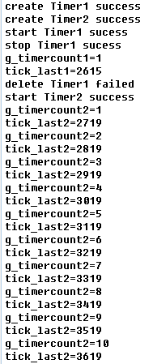   

<h3 id="4.10">4.10 双向链表</h3>

### 概述

#### 基本概念

双向链表是指含有往前和往后两个方向的链表，即每个结点中除存放下一个节点指针外，还增加一个指向其前一个节点的指针。其头指针head是唯一确定的。  

从双向链表中的任意一个结点开始，都可以很方便地访问它的前驱结点和后继结点，这种数据结构形式使得双向链表在查找时更加方便，特别是大量数据的遍历。由于双向链表具有对称性，能方便地完成各种插入、删除等操作，但需要注意前后方向的操作。  

### 开发指导

#### 功能

Huawei LiteOS系统中的双向链表模块为用户提供下面几个接口。

| 功能分类             | 接口名              | 描述                     |
|----------------------|---------------------|--------------------------|
| 初始化链表           | LOS\_ListInit       | 对链表进行初始化         |
| 增加节点             | LOS\_ListAdd        | 将新节点添加到链表中。   |
| 在链表尾端插入节点   | LOS\_ListTailInsert | 将节点插入到双向链表尾端 |
| 删除节点             | LOS\_ListDelete     | 将指定的节点从链表中删除 |
| 判断双向链表是否为空 | LOS\_ListEmpty      | 判断链表是否为空         |
| 删除节点并初始化链表 | LOS\_ListDelInit    | 将指定的节点从链表中删除，并使用该节点初始化链表  |

### 开发流程

双向链表的典型开发流程：

1.  调用LOS\_ListInit初始双向链表。

2.  调用LOS\_ListAdd向链表中增加节点。

3.  调用LOS\_ListTailInsert向链表尾部插入节点。

4.  调用LOS\_ListDelete删除指定节点。

5.  调用LOS\_ListEmpty判断链表是否为空。

6.  调用LOS\_ListDelInit删除指定节点并以此节点初始化链表。

### 注意事项

- 需要注意节点指针前后方向的操作。

### 编程实例

#### 实例描述

使用双向链表，首先要申请内存，删除节点的时候要注意释放掉内存。  

本实例实现如下功能： 

1.  调用函数进行初始化双向链表。  

2.  增加节点。  

3.  删除节点。  

4.  测试操作是否成功。  

#### 编程示例

代码实现如下：  
```  
#include "stdio.h"
#include "los_list.h"

#ifdef __cplusplus
#if __cplusplus
extern "C" {
#endif /* __cpluscplus */
#endif /* __cpluscplus */

static UINT32 DLlist_sample(VOID)
{
    LOS_DL_LIST DLlist = {NULL,NULL};
    LOS_DL_LIST DLlistNode01 = {NULL,NULL};
    LOS_DL_LIST DLlistNode02 = {NULL,NULL};
    LOS_DL_LIST DLlistNode03 = {NULL,NULL};

    PRINTK("Initial head\n");
    LOS_ListInit(&DLlist);

    LOS_ListAdd(&DLlist,&DLlistNode01);
    if (DLlistNode01.pstNext == &DLlist && DLlistNode01.pstPrev == &DLlist)
    {
        PRINTK("Add DLlistNode01 success \n");
    }

    LOS_ListTailInsert(&DLlist,&DLlistNode02);
    if (DLlistNode02.pstNext == &DLlist && DLlistNode02.pstPrev == &DLlistNode01)
    {
        PRINTK("Tail insert DLlistNode02 success \n");
    }

    LOS_ListHeadInsert(&DLlistNode02,&DLlistNode03);
    if (DLlistNode03.pstNext == &DLlist && DLlistNode03.pstPrev == &DLlistNode02)
    {
        PRINTK("Head insert DLlistNode03 success \n");
    }

    LOS_ListDelInit(&DLlistNode03);
    LOS_ListDelete(&DLlistNode01);
    LOS_ListDelete(&DLlistNode02);

    if (LOS_ListEmpty(&DLlist))
    {
        PRINTK("Delete success \n");
    }

    return LOS_OK;
}

#ifdef __cplusplus
#if __cplusplus
}
#endif /* __cpluscplus */
#endif /* __cpluscplus */  
```  

#### 结果验证

编译运行得到的结果为：   
```  
Initial head 
Add DLlistNode01 success 
Tail insert DLlistNode02 success 
Head insert DLlistNode03 success 
Delete success  
```  

<h3 id="5">5.Agent Tiny</h3>

### 概述

Agent Tiny是部署在具备广域网能力、对功耗/存储/计算资源有苛刻限制的终端设备上的轻量级互联互通中间件，开发者只需调用几个简单的API接口，便可实现设备快速接入到华为IoT云平台（OceanConnect）以及数据上报和命令接收等功能。   

以彩灯应用举例，Agent Tiny工作原理如下：   
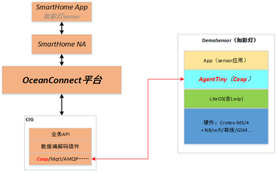  

### 开发指导

#### 使用场景

开发者只需实现平台抽象层接口，即可对接OceanConncet平台。  

#### 功能

Agent Tiny互联互通中间件为用户提供以下几类接口：  

| 接口分类           | 接口名               | 描述                                                                                                                                                                                                   |
|--------------------|----------------------|--------------------------------------------------------------------------------------------------------------------------------------------------------------------------------------------------------|
| Agent Tiny依赖接口 | atiny\_cmd\_ioctl    | Agent Tiny申明和调用，开发者实现。该接口是LwM2M标准对象向设备下发命令的统一入口，比如读写设备数据，下发复位，升级命令等。为了避免死锁，该接口中禁止调用Agent Tiny对外接口                              |
|                    | atiny\_event\_notify | Agent Tiny申明和调用，开发者实现，Agent Tiny把注册过程的关键状态，以及运行过程的关键事件通知用户，便于用户根据自身的应用场景灵活地做可靠性处理。此外，为了避免死锁，该接口中禁止调用Agent Tiny对外接口 |
| Agent Tiny对外接口 | atiny\_init          | Agent Tiny的初始化接口，由Agent Tiny实现，开发者调用                                                                                                                                                   |
|                    | atiny\_bind          | Agent Tiny的主函数体，由Agent Tiny实现，开发者调用，调用成功后，不会返回。该接口是Agent Tiny主循环体，实现了LwM2M协议处理，注册状态机，重传队列，订阅上报                                              |
|                    | atiny\_deinit        | Agent Tiny的去初始化接口，由Agent Tiny实现，开发者调用，该接口为阻塞式接口，调用该接口时，会直到agent tiny主任务退出，资源释放完毕，该接口才会退出                                                     |
|                    | atiny\_data\_report  | Agent Tiny数据上报接口，由agent Tiny实现，开发者调用，用户APP数据使用该接口上报，该接口为阻塞接口，不允许在中断中使用                                                                                  |

#### 开发流程

Agent Tiny典型场景的开发流程：  

1.  根据Agent Tiny提供的头文件说明，实现atiny\_cmd\_ioctl接口。该接口有三个参数，参数cmd为命令类型，参数arg的内存空间由Agent Tiny分配，其内容填充视cmd而异，如读数据相关命令，由device侧填充，Agent Tiny使用，如写数据命令，则由agent Tiny填充，device侧使用。参数len指arg所指向的内存空间长度，device侧填充或读取时，务必防止溢出。  

2.  根据Agent Tiny提供的头文件说明，实现atiny\_event\_notify接口。该接口有三个参数，参数stat为事件类型，参数arg是 Agent Tiny根据事件类型，传递给device侧的具体的事件信息，len为arg长度，device侧使用时务分防止溢出。  

3.  调用atiny\_init初始化Agent Tiny，获取对应的Agent Tiny句柄，开发者应处理该接口返回值，返回错误时，句柄无效。

4.  创建一个新任务，栈大小建议不小于4K，调用atiny\_bind，启动Agent Tiny。atiny\_bind调用成功后不再返回，atiny\_bind内部实现了Agent Tiny的主体任务。

5.  如需要停止Agent Tiny，调用atiny\_deinit，该接口等待Agent Tiny退出且释放资源后返回。

6.  atiny\_data\_report可以在开发者业务的任何一个任务中调用。

#### 互斥锁错误码

Agent Tiny对外接口和依赖接口，可能存在的错误，统一用以下错误码。  

| 序号 | 定义                          | 实际数值 | 描述               | 参考解决方案                                                       |
|------|-------------------------------|----------|--------------------|--------------------------------------------------------------------|
| 1    | ATINY\_OK                     | 0        | 正常返回码         |                                                                    |
| 2    | ATINY\_ARG\_INVALID           | -1       | 非法参数           | 确保入参合法                                                       |
| 3    | ATINY\_BUF\_OVERFLOW          | -2       | 缓冲区溢出         | 确保缓冲区充足                                                     |
| 4    | ATINY\_MSG\_CONGEST           | -3       | 消息拥塞           | 暂缓数据上报                                                       |
| 5    | ATINY\_MALLOC\_FAILED         | -4       | 内存申请失败       | 检查内存是否有泄漏                                                 |
| 6    | ATINY\_RESOURCE\_NOT\_FOUND   | -5       | 数据上报类型非法   | 检查数据类型是否正确                                               |
| 7    | ATINY\_RESOURCE\_NOT\_ENOUGH  | -6       | 系统资源不足       | 检查系统资源，比如信号量，套接字个数等，是否配置过少，或是否有泄漏 |
| 8    | ATINY\_CLIENT\_UNREGISTERED   | -7       | AgentTiny注册失败  | 检查psk，服务器信息等是否正确                                      |
| 9    | ATINY\_SOCKET\_CREATE\_FAILED | -8       | 网络套接字创建失败 | 检查网络配置和参数是否正确                                         |

#### 平台差异性
无。  

### 注意事项

- atiny\_cmd\_ioctl和atiny\_event\_notify禁止调用atiny\_deinit，atiny\_data\_report，atiny\_init，atiny\_bind四个Agent Tiny对外接口，否则可能产生死锁，或其他异常。

- 调用atiny\_deinit之前务必确认已调用atiny\_bin，否则atiny\_deinit将一直阻塞，调用完atiny\_deinit后，对应的Agent Tiny句柄将失效，禁止再使用。

- 承载atiny\_bind的任务栈大小建议不小于4K，任务优先级视系统情况而定，太低可能会导致接收丢包，发送延迟等现象。

### 编程实例

#### 实例描述

本实例实现如下流程：  

1.  实现atiny\_cmd\_ioctl和atiny\_event\_notify。  

2.  创建数据上报任务。  

3.  调用atiny\_init初始化AgentTiny。  

4.  调用atiny\_bind启动AgentTiny。  
 
#### 编程示例

**前提条件：**  

在工程配置中，WITH\_DTLS编译选项打开。  

**代码实现如下：**  
```  
#define MAX_PSK_LEN 16
#define DEFAULT_SERVER_IPV4 "139.159.209.89"
#define DEFAULT_SERVER_PORT "5684"
#define LWM2M_LIFE_TIME     50000
char *  g_endpoint_name_s = "11110001";
unsigned char g_psk_value[MAX_PSK_LEN] = {0xef,0xe8,0x18,0x45,0xa3,0x53,0xc1,0x3c,0x0c,0x89,0x92,0xb3,0x1d,0x6b,0x6a,0x33};
 
UINT32 TskHandle;
 
static void* g_phandle = NULL;
static atiny_device_info_t g_device_info;
static atiny_param_t g_atiny_params;
 
 
int atiny_cmd_ioctl(atiny_cmd_e cmd, char* arg, int len)
{
    int result = ATINY_OK;
    switch(cmd)
    {
        case ATINY_DO_DEV_REBOOT:
             result = atiny_do_dev_reboot();
            break;
        case ATINY_GET_MIN_VOLTAGE:
            result = atiny_get_min_voltage((int*)arg);
            break;
         default:
            result = ATINY_RESOURCE_NOT_FOUND;
            break;
        }
 
    return result; 
}
 
void atiny_event_notify(atiny_event_e stat, char* arg, int len)
{
    (void)atiny_printf("notify:stat:%d\r\n", stat);
}
 
void ack_callback(atiny_report_type_e type, int cookie, data_send_status_e status)
{
    printf("ack type:%d cookie:%d status:%d\n", type,cookie, status);
}
 
void app_data_report(void)
{
    uint8_t buf[5] = {0,1,6,5,9};
    data_report_t report_data;
    int cnt = 0;
        
    report_data.buf = buf;
    report_data.callback = ack_callback;
    report_data.cookie = 0;
    report_data.len = sizeof(buf);
    report_data.type = APP_DATA;
    while(1)
    {
        report_data.cookie = cnt;
        cnt++;
        (void)atiny_data_report(g_phandle, &report_data);
        (void)LOS_TaskDelay(2000);
    }
}
 
UINT32 creat_report_task()
{
    UINT32 uwRet = LOS_OK;
    TSK_INIT_PARAM_S task_init_param;
 
    task_init_param.usTaskPrio = 1;
    task_init_param.pcName = "app_data_report";
    task_init_param.pfnTaskEntry = (TSK_ENTRY_FUNC)app_data_report;
    task_init_param.uwStackSize = 0x1000;
 
    uwRet = LOS_TaskCreate(&TskHandle, &task_init_param);
    if(LOS_OK != uwRet)
    {
        return uwRet;
    }
    return uwRet;
 
}
 
void agent_tiny_entry(void)
{
    UINT32 uwRet = LOS_OK;
    atiny_param_t* atiny_params;
    atiny_security_param_t  *security_param = NULL;
    atiny_device_info_t *device_info = &g_device_info;
 
    device_info->endpoint_name = g_endpoint_name_s;
    device_info->manufacturer = "test";
 
    atiny_params = &g_atiny_params;
    atiny_params->server_params.binding = "UQ";
    atiny_params->server_params.life_time = LWM2M_LIFE_TIME;
    atiny_params->server_params.storing_cnt = 0;
 
    security_param = &(atiny_params->security_params[0]);
    security_param->is_bootstrap = FALSE;
    security_param->server_ip = DEFAULT_SERVER_IPV4;
    security_param->server_port = DEFAULT_SERVER_PORT;
    security_param->psk_Id = g_endpoint_name_s;
    security_param->psk = (char*)g_psk_value;
    security_param->psk_len = sizeof(g_psk_value);
 
 
    if(ATINY_OK != atiny_init(atiny_params, &g_phandle))
    {
        return;
    }
 
    uwRet = creat_report_task();
    if(LOS_OK != uwRet)
    {
        return;
    }
 
(void)atiny_bind(device_info, g_phandle);
}  
```  

#### 结果验证

1. 登录OceanConncet测试平台：  

<https://139.159.209.89:8843/index.html#/device>  

请在OceanConnect平台上提前注册账号。  

2. 选择查看“设备”。  
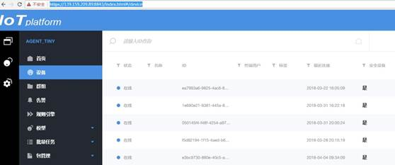  

3. 点击第一个设备，查看其设备标识码为11110001，说明设备已经注册。  
  
